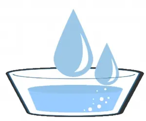

# 犬の飲水療法について

私たち人間も含め動物は水がなければ生きていけません。食べ物はある程度なくても生きていけますが、水が生きていく上で必要です。体を構成しているのは主に水です。水は生命維持にはかかせないものです。

しかし、動物の医療現場では水はあまり話題にはならず、論議もされていません。生きとし生けるもの、水の重要性を常に再認識する必要があります。

* 犬はどのように水を飲むか
* 犬にどのように水を飲ませるか
* 犬にどのくらい水を与えるか
* 犬がどのくらい水を飲むか
* どのような種類の水を与えるか

という問題を論議すべきであり、これは常に「古くて新しい」問題です 。
たかが水ですが、されど水です。ただ単に「犬には容器に入れて水を与えるとよい」という段階から考えを一歩前進させ、「犬をはじめとする動物たちの生命の営みには水の代謝が不可欠」と考えます。

なぜならば、生物学的により強く生きる彼らの生命の営みは、何時も激しく燃え尽きるローソクのように代謝速度が速いため、人間の1年は犬の7年にも相当するのです。水は体内に取り入れた栄養を全身へ運び消化を助け、さらに酵素を働き易くさせる役割を担います。このことからも生命の営みに対する水の代謝の影響力は多大だと言えます。

また、水は体温調節や体内の化学反応に対応することで体の組織の弾力を保つ等の働きもします。犬の体内に存在する酵素は35.0-40.0℃の環境下で活発になります。

水は呼吸系器官や皮膚から少量の蒸発をする時に、大量の気化熱*を奪って、体温調節を行い、体温を一定に保っています。つまり少量の水を動物の体から放出することで多くの熱を放出することができるということです。（*気化熱：液体の物質が気体になる時に周囲から吸収する熱）

ゆえに、犬の病気に対して動物病院では何かの薬剤と共に水分の補給（皮下輸液、静脈輸液等）をします。輸液による水分は脱水の改善だけでなく、同時に薬剤を体内に行き渡らせる働きをし薬剤の作用を助長します。これは日常の中でも不足する水分を補っておくことが体にはよいことと解釈されます。犬は水と共に生きて水を失うと死亡します。水分が15%以上失われると脱水となり死亡してしまいます。

## ◆体重で判定できる脱水の評価
脱水の評価は体重である程度判定できます。
例えば、

**3kgの犬が3%の脱水をすると、体重が0.09kg減少し、体重は2.91kg。**

**3.5kgの犬が3%の脱水をすると、体重が0.1kg減少し、体重は3.39kg。**

**4kgの犬が3%の脱水をすると、体重が0.12kg減少し、体重は3.88kg。**

だいたい犬は3%脱水すると、0.1kg体重が減少します。7kgの犬が3%脱水すると、0.2kg体重が減少します。ゆえにある意味では、小型犬の場合は0.1kgの体重の増減でも意味がある場合があると言えるでしょう。しかしこれは、体重を測定する時間によっても異なります。なぜならば食後に測定した場合体重は当然増えるためです。体重の測定は、食餌の前など、いつも決まった時間に行いましょう。

また、本来は3%の脱水の時点で分かると良いのですが、脱水の4-5%以下はなかなか分からないため、これは難しいかもしれません。

## ◆犬の体重測定で重要なこと
犬の体重測定で重要なことは、そのわずかな差を見逃さないことです。
例えば3.0kgの犬の体重が・・・

**2.9kgになった=75gの減少とは＝2.5%の体重の減少**

**2.8kgになった=150gの減少とは＝5%の体重の減少**

**2.7kgになった=225gの減少とは＝7.5%の体重の減少**

**2.6kgになった=300gの減少とは＝10%の体重の減少**

**2.5kgになった=375gの減少とは＝12.5%の体重の減少**

**2.0kgになった=750gの減少とは＝25%の体重の減少**

例えば7kgの犬の体重が・・・

**6.9kgになった=100gの減少とは＝2.5%の体重の減少**

**6.65kgになった=350gの減少とは＝5%の体重の減少**

**6.47kgになった=525gの減少とは＝7.5%の体重の減少**

**6.30kgになった=700gの減少とは＝10%の体重の減少**

**6.12kgになった=875gの減少とは＝12.5%の体重の減少**

**5.25kgになった=1.75gの減少とは＝25%の体重の減少**

例えば14kgの犬の体重が・・・

**13.65kgになった=350gの減少とは＝2.5%の体重の減少**

**13.3kgになった=700gの減少とは＝5%の体重の減少**

**12.9kgになった=1.05gの減少とは＝7.5%の体重の減少**

**12.6kgになった=1.40gの減少とは＝10%の体重の減少**

**12.2kgになった=1.75gの減少とは＝12.5%の体重の減少**

**10.5kgになった=3.5kgの減少とは＝25%の体重の減少**

例えば28kgの犬の体重が・・・

**27.3kgになった=700gの減少とは＝2.5%の体重の減少**

**26.6kgになった=1.4gの減少とは＝5%の体重の減少**

**25.9kgになった=2.1gの減少とは＝7.5%の体重の減少**

**25.2kgになった=2.8gの減少とは＝10%の体重の減少**

**24.5kgになった=3.5gの減少とは＝12.5%の体重の減少**

**21.0kgになった=7kgの減少とは＝25%の体重の減少**

これを人間の60kgの体重の人と比較すると・・・

**58.5kgになった=1.5kgの減少とは＝2.5%の体重の減少**

**57kgになった=3kgの減少とは＝5%の体重の減少**

**55.5kgになった=4.5kgの減少とは＝7.5%の体重の減少**

**54kgになった=6kgの減少とは＝10%の体重の減少**

**52.5kgになった=7.5kgの減少とは＝12.5%の体重の減少**

**48kgになった=12kgの減少とは＝25%の体重の減少**

水分は排尿、排便、発熱、あえぎ等によって、常に消失しています。現代獣医学上の犬の水分要求量は、環境、年齢、健康状態を含むいくつかの要因によって差がありますが、1日につき50-60ml/kgと言われ、これはほぼエネルギー要求量に近いと考えられています。しかしながら、統合獣医療（ホリスティック）的に考えると健康状態での飲水量はもう10-20%程多いのが理想的でしょう。
ゆえに飲料水は与えるのではなく、飲ませる？ものと考えても良いでしょう。しかし現代獣医学では、犬が100ml/kg以上の水を犬自身で飲むと多飲と判定されます。しかし犬が脱水している場合には、多めに水を与える必要があります。眼や口腔内が乾燥して、皮膚の弾力性が喪失している場合には脱水が疑われます。

犬は喉の渇きがある時のみ水を飲むため、犬の飲水療法はとても難しいです。本来なら犬が喉の渇きを感じる前に水分を補給させることが理想であり、犬に水の存在を知らせる機会を増やし、こまめに水が飲める回数を増やすことが重要です。つまり犬に水への興味を持たせることが必要です。また、同時に日常の健康管理もとても重要です。犬に元気があると喉の渇きを察知するセンサーがすばやく働き、早めに水を飲むことが可能になるからです。

犬の場合に急に多くの水を飲むからと言って、与えてはならない場合があります。
比較的胸の深い犬や大型犬（グレート・デン、ジャーマン・シェパード、ドーベルマン、アイリッシュ・セツター・、セント・バーナード、ワイマラナー、シャーペイ、ラブラドール・レトリバー、ゴールデン・レトリーバー、コリー、秋田犬、ロットワイラー、バーニーズ・マウンテン・ドッグ、スタンダード・プードル、ダックスフンド、トイ・プードル、コッカー・スパニエル、バセット・ハウンド等）は胃が捻転したり拡張したりする（胃捻転・拡張症候群）傾向のある犬種です。

以前はドライ・フードを早食いした後に、大量の水を飲み、その後運動したりすると、起こると信じられてきましたが、細菌いつも楽しそうにしている犬はなりにくく反対に何かいつも活発でない不安そうな犬が起こりやすいとの報告があります。不安、ストレス、興奮状態な犬に起こり易く、手術やペットホテルなどの預かりによっても起こり易くなります。

## ＜発症を抑える要因＞
* 食事をゆっくり食べさせる
* 食事回数を少量頻回にする
* 大量の水を食後に与えない
* 不安やストレスを取り除く（鎮痛剤、鎮静剤を使用）など

## ◆犬が水を飲むと体でどんなことが起こるか？
1. 犬の排便回数は1日1-2回が正常です。水を与えることで排泄を促します。肥満犬は水分分布が少ないため、水がより必要となります。水は空腹時に最もよく吸収されるため食餌中や食後すぐは避けます。食後１時間後に与えると新陳代謝が良くなり、ダイエットにもなります。

2. 犬が泌尿器の病気に罹った場合、水は結石、砂流に対して有効です。周囲に煙草の煙がある環境の場合はニコチンの解毒のために水が必要になります。犬の体の老廃物を追い出す素となるのは水による排泄力です。

3. 夏の時期は周囲の気温が高いため、より水分の補給が体温調節のためには必要となります。1日2回は是非水を取り替え、容器はいつも綺麗にし清潔に保ってください。特に容器の底には薄い膜（Biofilm）ができることがありますので気をつけましょう。飲水療法で最も重要なことは、犬が水を飲みたい時にいつでも水が用意されていることです。特に冷たい水が、熱中症対策にもなります。冷凍庫で凍らせた水を入れたペットボトルを水飲み容器の真ん中に置いておくと、冷たい水を長時間飲めるようになり、熱中症対策としてお勧めです。

*※ペットボトルに入れる水は凍ると膨張することを考慮に8割にします。*

## ◆犬の食餌中の水分と飲水
ドライ・フード（乾燥フード）には水分は約5-10%しか含まれていませんが、缶詰フードには70-80%の水分が含まれています。そのためドライ・フードの場合には、缶詰のフードの時と比べ水分を欲しがることを覚えておいてください。手を尽くしたにもかかわらず、どうしても水の飲み方が少ない場合には、缶詰フードを与えるとよいでしょう。

水を飲めば尿が排出されます。その際に出る尿の量と色に注意して見て下さい。正常な犬の尿の色は薄い黄色ですが、濃い場合は脱水が疑われ、尿量が少なければ脱水や尿の生成を妨げる病気を疑います。異常を感じた時は、尿を白い紙コップの中に採取し色調や匂いを調べます。また、薬局などで売られている尿試験紙でも定期的なチェックを行えます。

もし犬が「水を飲まなくなったら」「飲む水の量が減少したら」「飲む水の量が増加したら」、それは病気の兆候かもしれません。特に水を飲みたそうに、じっと見つめるだけの場合もあります。その場合はお腹に炎症があったり、お腹が痛い可能性もあります。さらに白血球が減少していることもあるので、すぐに動物病院で診察することをお勧めします。

## ◆動物は地球の水から生まれた
動物（人間も含めて）は地球の水から生まれました。犬（動物）の水分量は体の60%と言われています。人間と同様に犬も年齢を重ねるごとに体の水分量が減ってきます。（人間の場合は、出生時80％、10歳代70％、20～40歳代60％、70歳代50％） 特に肥満の犬では体内の水分分布が少ないため水分量が減少します。

地球の水分量（主に海、川等）と動物（人間）の水分量はほぼ同じであり、血液や羊水は海水の成分と似ているようです。昔の記録によると輸血の代わりに海水を用いたという言い伝えもあります。動物と地球の成分が似ている？ちなみに地球の呼吸数（海の波の数で測定）と人間の呼吸数は同じ18回/分とのことですが、波の高さはいろいろでも、世界何処の海岸でも波の回数は同じです。

犬の呼吸数は人間の呼吸数よりももう少し多く20-30回が正常です。しかし寝ている時に30回以上の呼吸数の場合は、詳しい検査が必要になるため動物病院で相談することをお勧めします。

## ◆与える水の種類
水道水は各々の地域の源泉によって硬度が異なるため、浄水器や製水器の使用をお勧めします。犬には非加熱性かつ弱アルカリ性軟水が最も良いのですが、より性能のよい浄水器、製水器を使用するのであれば水道水でも十分でしょう。

どの程度の軟水か硬水かを調べるには各地域の水道局のホームページで把握できます。硬水か軟水かを判定する試験紙、テトラテスト（総硬度試薬）等も売られています。
ちなみに、軟水は舐めると少し甘く感じ、軟水で米を洗うとより白くなります。一方、硬水は泡立ちが悪く、洗顔後皮膚がつっぱる感じがします。このように感覚としてもある程度判断できます

→「水があなたの犬の病気の原因になっていませんか？」と疑問を投げかけられることがまれにあります。覚えておくと役に立つことがあるかもしれません。

### ＜日本の水道水＞
日本の水道水の塩素量は世界で最も高いと言われています。これは清潔好きの日本では殺菌が重視されているからかもしれません。高い塩素が犬の健康に悪影響をもたらすかは今のところ不明であり、被害はあまり論議されていません。しかし、水中に暮らす魚には水道水を使用する人はいないと思います。何であれ水道水が良いと言うにはちょっと無理があるでしょう。

硬水を軟水に変える装置（硬水軟化装置－water softener）を使用している水は、特に高齢の犬には投与しない方が良いと考えられています。硬水軟化装置とは塩を使用したイオン交換樹脂の働きで水中に含まれるカルシウムイオン、マグネシウムイオンなどの陽イオンをナトリウムイオンに置き換える装置であり、米国等ではよく一般家庭に設置されています。

水道水の塩素の問題は、飲水の問題だけでなく肌に触れた場合も、脱塩素の水とは異なる刺激を感じる人もいるようですので、犬にもできれば脱塩素化の水を使用することをお勧めします。
水道水以外では、軟水系のミネラルウォーターや地下深層水（特に体力の衰えた場合）等を交互に使用することをお勧めします。
水道水を半分凍らせて、表面を割り、凍らない半分の水を捨て、白くない透明部分の氷を溶かすと雪解け水のようになり比較的良い水が出来上がります。
肌に触れる水の場合は、ガーゼにミカン大の木炭を包み、500mlぐらいの水に7-8時間漬けて置くと肌にとって良い水になります。これは風呂に入れる場合は特に有効です。また白米や玄米のとぎ汁を24時間程度（夏場は12時間）置き、これを風呂に使用することも有効です。

水道水を煮沸すると塩素は飛んでカルキ臭は無くなります。しかし、短い5-6分の煮沸では逆に毒性のあるトリハロメタンが2-3倍程増えます。ヤカンの蓋を空けて30分以上沸騰させることでトリハロメタンを消せますが、現実問題となると少し難しい感じがします。沸騰させた水の保存期間は冷蔵庫で12-24時間以内です。

一般的に犬に水を与えると、肝臓や腎臓に作用して、老廃物の排出がよりスムーズになります。正常の場合、消化管や腎臓を通じて清浄化されるはずの老廃物が水の不足により体に蓄積して、毛細血管に押し戻され血管や臓器に悪い影響を与える可能性があります。
犬に定期的により多くの水分を与えると、体内の酸性の状態が改善されます。
犬に冷え症があるか論議されるところですが、西洋医療ではの冷えに対しての対応は困難なため、まずは、水を与えることから始めます。

### ＜ミネラルウォーター＞
我が国のミネラルウォーター類の品質表示ガイドラインは平成2年と平成7年に内容物の表示を農林水産省によって定められています。ミネラルウォーター類と言われる分類は、ナチュラルミネラルウォーターを原水とし、品質を安定させる目的などのためにミネラル調整、複数の水源から採水したナチュラルミネラルウォーターの混合などが行われているものです。

◇ナチュラルミネラルウォーター
ナチュラルウォーターは特定の水源から採水された地下水を原水とし、沈殿、濾過、加熱殺菌以外の物理的・化学的処理を行わないものと規定されています。ナチュラルウォーターのうち鉱化された地下水「地表から浸透し、地下を移動中又は地下に滞留中に地層中の無機塩類が溶解した地下水（天然の二酸化炭素が溶解し、発泡性を有する地下水を含む）をいう」を原水としたもの。

### ＜飲用水、ボトルドウォーター＞
ナチュラルミネラルウォーター及びミネラルウォーター以外のものです。

### ＜蒸留水（Distilled water）や純水（Pure water）＞
常用する水の中で注意すべき水です。これらの水は本来、精密機械の洗浄用の水です。 生のままで飲めないわけではありませんが、生で犬に与えることはお勧めしません。犬に与えても直ぐに体内の反応が出るわけではありませんが、長く与えればそれだけ健康を害する恐れがあります。

蒸留水の水槽に淡水魚を放すと、酸素がないため窒息死しますし、人間では絶食時に蒸留水を1.8Lも飲めば死に至る危険性があるようです。

災害用水（5年間保存水など）は蒸留水、純水または超高温加熱殺菌水です。厳しく言うとこれらの水は飲水と言うより、災害時には料理に使用する程度の水と理解した方が無難でしょう。
以前、一部の飼い主向け米国記事に「犬の水に蒸留水を」という記載がありましたが、現在ではこの説はほぼ否定されています。

## ◆病気に対する水の作用と可能性
どのような水を病気に対して使用するかは、病気によっても多少の違いはあります。十分な水分補給により、病気の発症を遅らせる可能性には期待できるでしょう。

*＜水に期待できる作用＞*
* 弱アルカリイオン水・・腎臓、膀胱、胆嚢等の結石
* 地下深層水・・・・・・病気などで体力が衰えた場合
* バナジウム水・・・・・糖尿病、コレステロールの改善
* 炭酸水・・・・・・・・関節炎、脊椎炎、低体温等（常用しない）
* 硬水・・・・・・・・・アレルギー疾患（常用しない）
* 水素水・・・・・・・・まだ不明な点が多いためここでは記載を控えます。

*※犬には硬度が高い水は消化器症状等が現れ食欲が低下する場合があり、本来不向きのためお勧めできませんが、ミネラルがやや多めの硬水を3日に1回程度、腎不全がない犬に免疫強化を期待して投与することはできます。若齢や高齢の犬では腎機能が低い可能性がありカルシウムがろ過できないため硬度の高い水は避けましょう。*

私の過去40年間以上の臨床経験からして、飼い主が犬に水を効率的に飲ませることにより多くの病気が予防できているように感じます。また病気の発症を遅らせたり基礎治療にも反応する等、そのような感覚もあります。

しかし、ジュースや牛乳等の水分は水の代わりにはなりませんので1日の必要水分摂取量としてはカウントされません。

## ◆水を多く与えてはならない例
例えば、急性の腎臓病、心臓病（肺水腫等）、飲んでもすべて吐く場合、熱中症、脱水症等の場合等です。脱水時には普通の水でなくミネラルを含んだ水を与える必要があります。家庭で行う場合はスポーツドリンクを5-6倍薄めたものや、少量の海塩を加えて与えることが可能です。実際行う時には別途この方面に詳しい獣医師と御相談ください。

## ◆いかに工夫すれば犬に水をよく飲んでもらえるか？その30の方法とは？
1. 多頭飼いの場合は水の容器を頭数より多くし、あちこちに置く。※寝床と食事場所への設置が必須。（犬は本能的に毛や埃などが付着している水より、綺麗な水を好む習性がある。）

2. 高齢の犬には容器を床に置かずに伏せた容器の上や台等を置いて高くする。（容器の位置が低いと前肢の肘や首を曲げると痛がる犬がいる可能性があるため飲みやすくなる。）

3. 水にブイヨンや少量の海老等を入れて風味を変えて与える。（飲水の味付けには、鶏や魚の煮汁を水に加えることもできる。）

4. 時々であればスポーツドリンクを5-6倍に水で薄めて与えるとより飲むことも可能。（純粋な意味で水ではなくなりますが、多く薄めれば可能。）

5. 犬とコミュニケーションをとりながら、直接容器を口もとに運んで飲ませる。（また遊びながら、スポイト等で直接、口に入れて飲ませることもできる。）

6. 様々な形の容器を用意する。特に浅いお皿が望ましい。（浅いお皿は犬の髭が当たりにくくなり飲みやすくなる。）

7. お皿のような浅い広い容器に入れた水は、ひげが当たらないので特によく飲むことがある。（容器のいろいろなサイズや形によっても興味を持ち飲むことがある。）

8. 特に嫌がることがなければ、一時間毎に2-3mlの水を注射器（スポイト等）で与える。（少量頻回がコツである、少しずつ量を増加することも可能な場合がある。）

9. 循環式流水器を利用すると、犬は近寄り舐めることがある。（犬は猫ほどではないが本能的に動くものに興味を持つ。最近は価格も安くなった。）

10. 犬に飲水前後にマッサージ（運動の代わり）をする。（マッサージは運動の代わりになりますし、犬との信頼関係も良くなる。）

11. 常温ではなく、ぬるま湯を与える。ただし体温以上にはしない。（少し温めて与えると味がまろやかになるためか、飲むこともある。）

12. 風味付きアイスキューブを作成する、例えば肉を煮沸して凍結させる。（水の容器に、肉入りアイスキューブを入れて、水を飲ませると風味が増す。）

13. いつでも水を飲めるように、各水のみ場には明りが必要。（夜間はセンサー付きのライトで、夜間でも明るい場所で水を飲める状態が必要。）

14. 夏の時期には、おやつの代わりに少量の氷を与えると、舐めることがあります。（食間に与える、溶け始めに興味を示すことがある。）

15. 与える前に水をカクテルのようによく振ってから与えると飲む可能性がある。（これは水の分子が細かくなるため。大きなペットボトルでよく振る。）

16. 与える食事にスプーン5-8杯の水やぬるま湯をかけて、水分量を多くして与える。（この方法は概して猫は難しく、犬ではうまく行くことが多い。）

17. 水を与える容器は、清潔に保ち、特に底の部分はよく洗うことが重要。(容器の底には眼に見えない滑りが、存在することがあり、味を悪くする。)

18. プラスチック容器は避けて、ステンレス、ガラス、セラミック製の容器で与える。（プラスチックは口周辺にアレルギー性皮膚炎、また化学反応で味を悪くする？）

19. 容器もステンレス、ガラス、セラミック（陶磁器）等、材質による好みがある。（容器の素材によって温度や風味が違う、木製の素材等、いろいろ試すと良い。）

20. セラミック（陶磁器）容器に入れ、ある程度の時間を置いた水はより好む場合がある。（陶磁器には、微小の穴がたくさんあり、ゆっくり蒸発されると気化熱で冷える）

21. もし可能なら、ポタポタと水が出ている蛇口に犬を抱いて近づけると飲むことある。（猫ほどではないが犬は本能的に動くものに興味を持つ。この原理を利用する。 ）

22. 缶詰フードに、少し水を含ませると食事と共に水分補給できる。（これは水に少しのフードを入れて飲ますのと逆のパターン。）

23. 犬は安全で静かな環境での飲水を好む傾向がある。（例えば背後に別の犬がいるなどの環境では飲むのを止めることがある。）

24. 犬の水のみ場とトイレが近いと、犬はその近くの水を飲まない傾向にある。（犬は清潔好きが多く、近くに悪臭のある場所は好まない。）

25. 食事の食器と水の容器が近すぎると犬があまり水を飲まない傾向にある。（食事の場所、水飲みの場所、トイレの場所は離れた三角形の領域が望ましい。）

26. 犬の好みも個体差があるので、水の種類をいろいろ変えて投与してみる。（水道水、ボトルの水、地下深層水、水素水、ミネラルウォーター等から選択する）

27. 水道水の場合は、沸騰させ重湯（白湯）して与えると飲むこともある。（やかんの蓋を開けて30分間以上沸騰、その後10℃～15℃で与える。）

28. 水の容器に氷の欠片を入れ水に浮かせると動くので興味を持ち飲むことある。（犬は流水を好む傾向があるので、これもこの原理を利用したもの。）

29. 水道水の場合は脱塩素（浄水器を使用、又はガーゼにミカン大の木炭を包み、500mlぐらいの水に7-8時間浸す）すると、犬はより水をよく飲む。これは特に子犬においてその傾向が強い。

30. 殺菌処置をしていない、弱アルカリ性の水は、一般的に犬がよく飲む水である。（このような買い置きの水が常にあれば、災害時にも役立つ。）

### 参考文献
[^1]:体重で判定できる脱水の評価
[^2]:犬の体重測定で重要なこと
[^3]:犬が水を飲むと体でどんなことが起こるか？
[^4]:犬の食餌中の水分と飲水
[^5]:動物は地球の水から生まれた
[^6]:与える水の種類
[^7]:病気に対する水の作用と可能性
[^8]:水を多く与えてはならない例
[^9]:いかに工夫すれば犬に水をよく飲んでもらえるか？その30の方法とは？
[^10]:Nutrition small animals, Water , The Merck Veterinary Manual 9th Edition
[^11]:Hypopenia in cat and dog: ability of the cat to meet its water requirements solely from a diet of fish or meat. American Journal of Physiology 1959 Prentiss PG. Wolf AV. Eddy HE.
[^12]:Water balance in the dog and cat, Journal of Small Animal Practice Volume 23, Issue 9, pages 588–598, September 1982
[^13]:病気を治す飲水法、万病を予防し治す水の力を総解説、バトマンゲリジ、中央アート出版社
[^14]:正しい水の飲み方選び方、藤田 紘一郎、海竜社

[^1]
[^2]
[^3]
[^4]
[^5]
[^6]
[^7]
[^8]
[^9]
[^10]
[^11]
[^12]
[^13]
[^14]