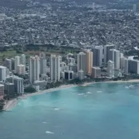
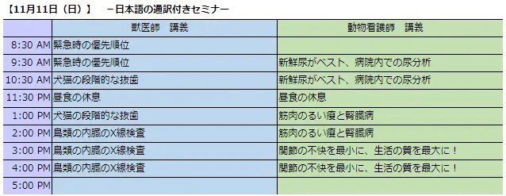
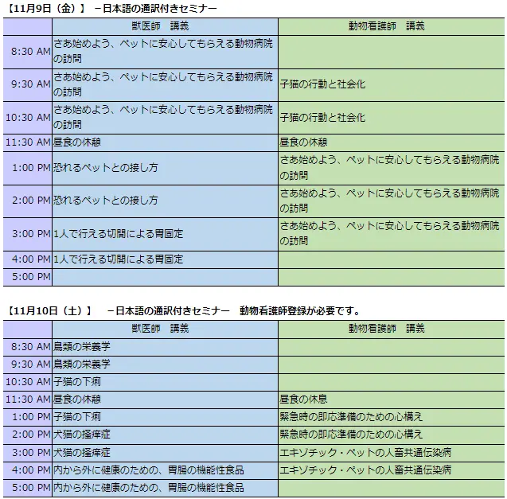
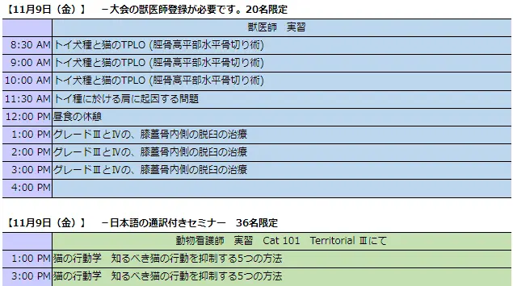
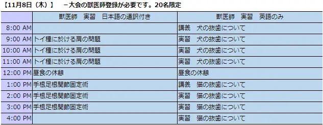
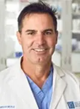
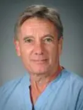
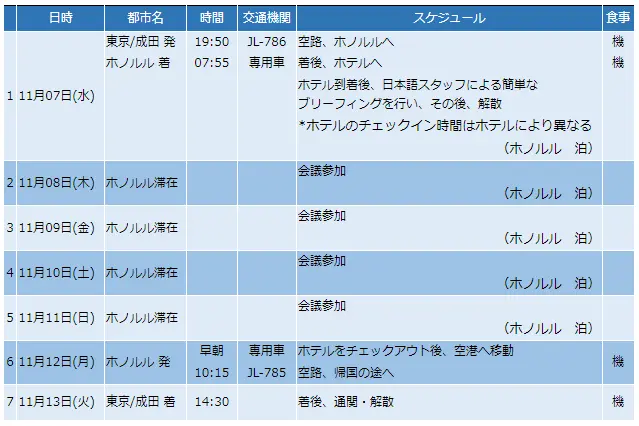

# ハワイ獣医師会年次大会 「Dr. Brian Bealeのセミナー」へのお誘い

第65回ハワイ獣医師会年次大会「Dr. Brian Beale.のセミナー」info-
--WVC獣医師外科セミナーでおなじみのDr.Brian Bealeのセミナー開催--

*第65回ハワイ獣医師会年次大会参加ツアーのお知らせ*

**
第65回ハワイ獣医師会年次大会「Dr. Brian Beale.のセミナー」は終了いたしました。ご参加いただきましてありがとうございました。
**

日　程　　　　：　2018年11月8日（木）～9日（金）　2日間　実習セミナー 
主　催　　　　：　第65回ハワイ獣医師会年次大会（11月9日（金）～11日（日）） 
場　所　　　　：　Hilton Hotel Wikiki Beach 
スポンサー 　 ：　Veterinary Orthopedic Implant、Intrauma（フクシン） 

VOI社は日本語でのメールの注文が出来ます。担当はボーランくみさんです。お知らせいただければ、彼女のメールアドレスをお知らせします。

#### 

ハワイ獣医師会年次大会のセミナーのご案内です。
今年度のハワイ獣医師大会は、11月9日～11日に行われます。毎年恒例の、講師Dr. Brian BealeとDr.Don Hulseの整形外科セミナーで日本語の通訳付きは2日間行われます。2日目は、大会セミナーの初日と重なります。

## セミナー内容詳細

■1日目　11月8日 

* トイ種に於ける、肩に起因する問題
* 手根足根関節固定術

■2日目　11月9日 

* トイ犬種と猫のTPLO（TPLO(脛骨高平部水平骨切り術)
* グレードⅢとⅣの、膝蓋骨内側の脱臼の治療

#### 

ハワイ獣医師会の年次大会にて毎年行われており定評の「 Dr. Brian Bealeの整形外科セミナー」はDr.Brian BealeとDr.Don Hulseの師弟コンビによる恒例のセミナーです。今回は講義と骨のモデルを使用した実習となります。

今年度の初日午前のメインテーマは、主にトイ種に於ける、肩に起因するいろいろな諸問題、骨折、脱臼等の問題を扱います。午後は手根骨と足根関節の固定術についてです。

2日目の午前のメインテーマは、主にトイ犬種と猫のTPLO（TPLO(脛骨高平部水平骨切り術)跛行診断、整形外科疾患のX線検査の読影、解剖学的な回転角度を中心とした水平化骨きり術について。午後は、特に膝蓋骨内側の脱臼のグレードⅢとⅣの治療についてです。

今回も盛りたくさんの欲張った内容となっておりますがご理解ください。始めに講義その後は実習です。もし時間に余裕があれば、各々が知りたい手術も学ぶことが可能かもしれません。どうぞ講師である経験豊かな外科専門医（Dr.Brian BealeとDr.Don Hulse）にお尋ねください。

* 英文の大会の詳細は「第65回ハワイ獣医師会年次大会のホームページ」をご覧ください
* 各々の講師については英文の「セミナー講師の紹介」をご参照ください。
* 英文の「セミナーのスケジュール」

*
展示のスケジュール
*
* 11月09日（金）8:00am – 5:00pm
* 11月10日（土）8:00am – 6:00pm
* 11月11日（日）8:00am – 4:00pm

*
日本語の通訳者－予定－
*
* 青木美恵先生（動物総合病院　院長）
* 茨木一成先生（茨木動物病院　副院長）
* 直井昌之先生（直井動物病院　院長）
* クリスティ－ナ・ナオミ・アララ先生（所沢アニマルメディカルセンター）

# プログラム
#### 
#### 
#### 
#### 

# 
講師紹介

#### 
**Dr. Brian Beale.** 
1985年にフロリダ大学にてD.V.Mを取得。その後、フレンドシップホスピタルにてインターン、 フロリダ大学にて外科のレジデンス、そして1991年に外科専門医療を摂取し、フロリダ大学獣医学部の助教授となり、1992年にGulf coast veterinary specialistsに所属し、現在はテキサスA&M大学獣医学部の非常勤助教授でもあります。彼は毎日曜日の夜の午後8時の番組のKTRH（AM740）にて、「あなたのペットの健康」でホストとして活躍もしています。また彼は世界の国際的な獣医学会議での招待講演者です。

#### 
**Dr.Don Hulse.** 
1970年にテキサスA & M大学にてD.V.Mを取得。その後、1973年カンザス州立大学にて外科のレジデンス、1977年に米国獣医外科専門医(ACVS)を取得し、その後ル イジアナ州立大学、オクラホマ州立大学にて外科専門医として1984年まで勤務し、その後はテキサスA＆M大学の整形外科の教授を務めていました。彼は獣 医界の整形外科をリードする先駆者であり、世界の国際的な獣医学会議での招待講演者です。ここ10年以上はオースティンエリアにて手術を行っており、AUSTIN VETERINARY EMERGENCY & SPECIALTYのパートナーに所属しています。

# 旅行のツアープラン
#### 
【JL】日本航空　　【機】機内食(軽食を含む) 
【時間帯の目安】　早朝（06:00～07:30） 

<a href="https://www.gohawaii.jp/">ハワイ観光協会のホームページはこちら</a>
