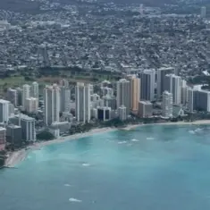
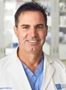

# ハワイ獣医師会年次大会 「Dr. Brian Bealeのセミナー」へのお誘い

*第66回ハワイ獣医師会年次大会参加ツアーのお知らせ*

**
第66回ハワイ獣医師会年次大会「Dr. Brian Beale.のセミナー」は終了いたしました。ご参加いただきましてありがとうございました。
**

日　程　　　　：　2019年11月7日（木）～8日（金）　2日間　実習セミナー 
主　催　　　　：　第66回ハワイ獣医師会年次大会 11月8日（金）～10日（日） 
場　所　　　　：　Hilton Hotel Wikiki Beach 
スポンサー 　 ：　Veterinary Orthopedic Implant、Intrauma（フクシン） 

VOI社は日本語でのメールの注文が出来ます。担当はボーランくみさんです。お知らせいただければ、彼女のメールアドレスをお知らせします。

#### 

ハワイ獣医師会年次大会のセミナーのご案内です。
毎年恒例の、講師Dr. Brian BealeとDr.Don Hulseの整形外科セミナーで日本語の通訳付きは2日間行われます。2日目は、大会セミナーの初日と重なります。**また今年度より、日本人の参加者が、各々自由に学会の登録がクレジットカードで出来るような制度に変えて頂きました。誰でもが簡単に登録（今までは小切手の送付が原則）できるようになりました。この制度改革により、参加者が増えることが予測され、学会の責任者であるDr,AKOも大いに期待していらっしゃいます。**

第66回ハワイ獣医師会年次大会のお申し込みに、PayPal経由のクレジット・カードでの参加申し込みを御希望の方は、「第66回ハワイ獣医師会年次大会の申込方法」をご参照ください。尚、オンラインでは大会前日までお申し込みいただけます。
日本人個人参加者においても、 International Registration.（海外登録） を利用せずに、Annual Conference（年次大会）から、Registration（登録）を選び、Log in now or join HVMA（大会への参加）からの登録でも、我々日本人の登録がクレジットカードにて出来ますので、御利用ください。

## セミナー内容詳細

■1日目　11月7日 

* 骨盤骨折
* 骨盤脱臼

■2日目　11月8日 

* 上腕骨の骨折
* 上腕骨の遠位のY骨折

ハワイ獣医師会の年次大会にて毎年行われており定評の「 Dr. Brian Bealeの整形外科セミナー」はDr.Brian BealeとDr.Don Hulseの師弟コンビによる恒例のセミナーです。今回は講義と骨のモデルを使用した実習となります。初日午前のメインテーマは、主に骨盤骨折に起因する諸問題を扱います。午後も骨盤の脱臼に於けるいろいろな問題を取り扱います。

2日目の午前のメインテーマは、主に上腕骨の骨折について。午後は、特に上腕骨の遠位のY骨折についてです。今回も盛沢山の欲張った内容となっておりますがご理解くださいとのこと。始めに講義その後に実習です。もし時間に余裕があれば、各々が知りたい手術も学ぶことが可能かもしれません。どうぞ講師である経験豊かな外科専門医（Dr.Brian BealeとDr.Don Hulse）にお尋ねください。

**※この個人での登録の際には、ハワイ獣医師大会のテキストの文章が、インターネット経由でダウンロードできる、パスワードが送られてきます。不明の参加者は、私にお尋ねください。**

*
展示のスケジュール
*
* 11月08日（金）8:00am – 5:00pm
* 11月9日（土）8:00am – 6:00pm
* 11月10日（日）8:00am – 4:00pm

# プログラム
#### 

# 
講師紹介

#### 
**Dr. Brian Beale.** 
1985年にフロリダ大学にてD.V.Mを取得。その後、フレンドシップホスピタルにてインターン、 フロリダ大学にて外科のレジデンス、そして1991年に外科専門医療を摂取し、フロリダ大学獣医学部の助教授となり、1992年にGulf coast veterinary specialistsに所属し、現在はテキサスA&M大学獣医学部の非常勤助教授でもあります。彼は毎日曜日の夜の午後8時の番組のKTRH（AM740）にて、「あなたのペットの健康」でホストとして活躍もしています。また彼は世界の国際的な獣医学会議での招待講演者です。

#### 
**Dr.Don Hulse.** 
1970年にテキサスA & M大学にてD.V.Mを取得。その後、1973年カンザス州立大学にて外科のレジデンス、1977年に米国獣医外科専門医(ACVS)を取得し、その後ル イジアナ州立大学、オクラホマ州立大学にて外科専門医として1984年まで勤務し、その後はテキサスA＆M大学の整形外科の教授を務めていました。彼は獣 医界の整形外科をリードする先駆者であり、世界の国際的な獣医学会議での招待講演者です。ここ10年以上はオースティンエリアにて手術を行っており、AUSTIN VETERINARY EMERGENCY & SPECIALTYのパートナーに所属しています。
