# WVC（西部獣医会議） 継続教育、オクエンドセンターでの実習ラボ

**2018.6.21-23開催セミナー終了報告** 
WVC（米国の西部獣医会議）主催による 
2018年度「WVC日本人のための獣医師外科実習セミナー」 

2018年6月次開催（6月21日-23日） 
胸部系、腹部系、呼吸系、インターベンショナル・ラジオロジー

**
6月開催セミナー終了いたしました。ご参加いただきありがとうございました。
**

トラブルもなく（参加者のパスポートのタクシー置き忘れ事件がありましたが、すぐに解決し良かったです）3日間の実習がつつがなく終了致しました。心配していた実習に遅れる参加者もなく、安堵致しました。参加者の皆様に感謝申し上げます。また後援各団体様、協賛各社様にも厚く御礼申し上げます。

### ＜WVC獣医師外科セミナーの特徴＞
1. 内閣府認定のNPO法人の企画・運営で営利を目的としていないこと。
2. 獣医師が管理し、獣医師が運営し、獣医師の団体が後援していること。
3. 後援する団体、協賛する各社のスポンサー方式を組織していること。
4. NPO法人ゆえに、利益目的でなく、参加費用をできるだけ低く設定していること。
5. セミナー申込金等の各種追加料金が発生しないこと。
6. 招聘の講師数は、3人体制で、参加者8人つき一人とオクエンドセンター基準に合致。
7. セミナー中にハンドアウトのPDF版を参加者にPDFにて配布。
8. セミナー最終日又は後日、使用したスライドのPDF版を参加者にPDFにて配布。
9. 講義前の予習用に講義の参考資料等を、可能な場合メールにて事前に配布。
10. 講義後の参加者に講義・実習等のDVDを、無料にて、終了1ヵ月後に配布。
11. 指定ホテルの場合は、WVCよりディスカウントコードが提供されます。
12. 指定の旅行会社により手数料各5400円にて飛行機、ホテル等の予約が可能。
13. 自身でも旅行社の選定ができ、公明正大で利権にとらわれない。
14. このWVCの海外セミナーには、申し込み金等の規定がありませんので、不必要。
15. 大学、専門病院等からインストラクターを招待して、実習の補助も行う予定。
16. 受講時間が72、120、168時間に達する当研究所認定の別の終了証書も予定。
17. 認定病院制度があり、参加回数や時間によって認定病院と認められます。

#### 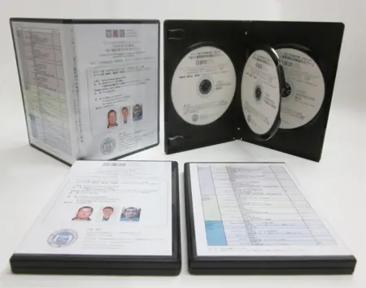

参加者に配布した講義・実習等のムービーDVD

#### 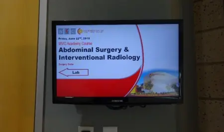

セミナー会場の様子(2018年6月21-23日）-1

#### 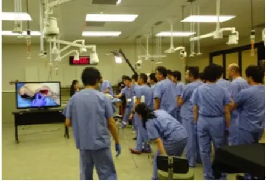

セミナー会場の様子(2018年6月21-23日）-2

#### 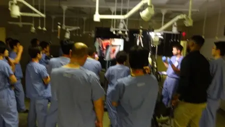

セミナー会場の様子(2018年6月21-23日）-3

#### 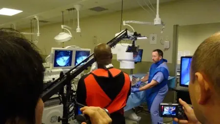

セミナー会場の様子(2018年6月21-23日）-4

# 概要
日程：2018年6月21日（木）～6月23日（土）　3日間 
内容：胸部系、腹部系、呼吸系、インターベンショナル・ラジオロジー 
セミナー費用：286,000円（26名様限定） 

#### 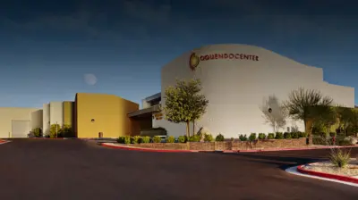

主催：Western Veterinary Conference (WVC) 

企画&運営：特定非営利活動法人　小動物疾患研究所（理事長小宮山典寛） 

後援：有限会社スピリッツ HJS事務局、日本獣医救急医療研究会、日本獣医クリティカルケア＆マネージメント研究会 

特別協賛：株式会社 V and P（VetzPetz ）、ペットコミュニケーションズ株式会社 

協賛：テルコム株式会社 

講師／通訳： 
・Dr.William Culp, VMD, DACVS（カリフォルニア大学デービス校の教授） 
・Dr. Jim Perry, DVM. phD ,ACVIM ,ACVS （ペンシルバニア大学、助教授） 
・Dr. Ameet Singh . BSc, DVM, DVSc, ACVS （オンタリオ大学の外科の助教授） 
・通訳者：久保田朋子先生

# 内容詳細
**胸部系、腹部系、呼吸系、インターベンショナル・ラジオロジーについて**

コーディネーター　小宮山典寛

今回のオクエンドセンターでの実習は、外科手術の中級から上級者を対象に、構成されています。実に多くの外科手術が学べます。初日は食道疾患の外科手術ですが、頸部食道の切開術それに関連する、食道チューブの設置法、また腹部手術の基本である胃の切開術、胃拡張捻転症候群や胃拡張の際に必要な胃固定術及び胃切開と並で称される腸管切開と吻合の最新の正しい方法を学ぶことができます。

#### 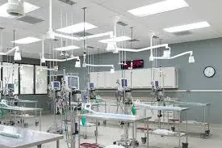
　また今回は特に、稀ではありますが、大腸の腫瘍外科の代表的なテクニックである、直腸牽引術(又は粘膜のみを引く抜く方法すなわち、直腸粘膜外転術（プルスルー）も学ぶことができます。

#### 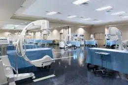
　初日の午後は肺、心膜、短頭種の気道の手術で、胸部の外科手術の2大適応である、側面開胸術による-肺葉切除術と部分的心膜切除術を学びます。また正しく知らないと効果がでない手術で、苦手意識が強い、短頭種の閉塞性の気道の手術をしっかり学びます。知るべき代表的な疾患である口蓋垂切除術、外鼻孔再建術、咽頭小嚢の反転を学びます。
2日目は、実習でしか学べない手術として有名な、喉頭麻痺の外科手術である、披裂軟骨側化術（タイバック）をしっかり学びます。また気管虚脱の外科手術は現在では専門的な手術としてステントが使用されますが、以前行われていた管腔外のリングプロテーゼ（装具）の手術の利点と欠点を学び、その適応を考える機会として学びます。

2日目の午後は、知らないと苦労する手術で、特に右腎が難しい副腎摘出術を学び、また、実習例では学び難い手術でありますが、自身が何処まで知って、何ができるかがわかるように理解すると良い、門脈大静脈短絡を学びます。また正しい方法の部分的及び完全肝切除術も予定しています。もし時間があれば、驚くほど簡単にできる肛門嚢摘出術も学ぶことが出来るでしょう。

#### 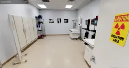
　最終日の午前中は、犬猫に起こる、各種のヘルニアの修正術について学びます。横隔膜ヘルニア、裂孔ヘルニア、会陰ヘルニアです。 会陰ヘルニアは特に、ペキニーズ、ボストン・テリア、ボクサーに多発し、再発率が高く、困った症例に属しますが、その解決方法をお聞きください。
最終日の午後は、最近猫でよく遭遇する、尿管閉塞の手術であり、今回のメインテーマであるSUBシステムの方法を学びます。ステントとの違い利点と欠点、その使い分けも学ぶことができると思います。これらの疾患は最近増加しており、内科療法ではあまり対処できないので、外科手術の症例と言われています。

#### 
また、これらの手術は、例えば以前に行われていた尿管の吻合等の手術は部位にもよりますが、その適応は難しく困難を伴うものでしたが、5-6年ほど前からはステントやSUBの方法が開発され、現在は猫の場合はこのSUBシステムが主流になりつつあります。この手術はドライラボではなかなか習得は難しく、実際に手術をするとなると、やはり検体（遺体）でのラボがより良いと思われます。現在では、猫の尿道閉塞にはSUBシステム、犬の尿道閉塞にはステントが良いと考えられているようです。

　今回は少し欲張ったテーマとなり、盛り沢山ですが、事前に予習することで、有効な時間になると思います。講師の先生は2人ではなく、外科の専門医である3人にお願いしておりますので、実習の際にも、各テーブルに待ち時間が少なく、十分に実習が堪能できると思います。3人の専門医の招聘にはそれだけ経費が掛かりますが、この実習は、無駄な経費を極力かけずに企画しているので、より参加しやすく効果的に学べると思います。

#### 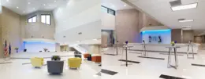
また講義のテキストとは別に、講演のスライドのPDFを、会場でCDにて配布するよう講師に要望し手配をしていますので、より理解しやすい講演になると思います。またSUBシステムのNorfolk Vet Productsの日本の代理店である、SANEI AMERICA CORPORATION　（担当：石井美樹さん）にスポンサーをお願いしています。注文をご希望の場合は、各々連絡しますのでお知らせください。

# プログラム
講師／通訳： 
・Dr.William Culp, VMD, DACVS（カリフォルニア大学デービス校の教授） 
・Dr. Jim Perry, DVM. phD ,ACVIM ,ACVS （ペンシルバニア大学、助教授） 
・Dr. Ameet Singh . BSc, DVM, DVSc, ACVS （オンタリオ大学の外科の助教授） 
・通訳者：久保田朋子先生

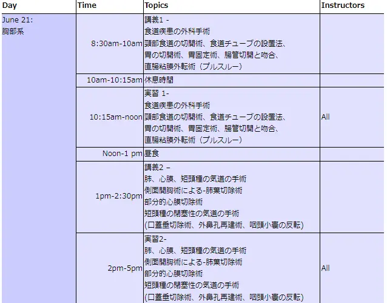
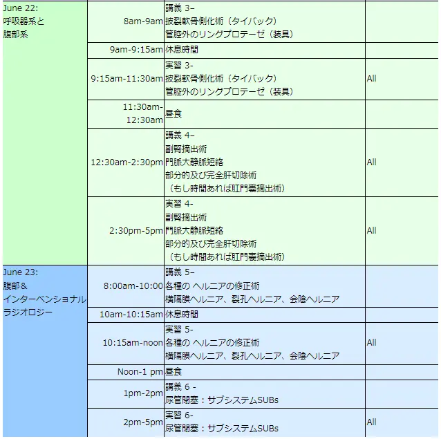

* プログラムの時間配分が少し変更になりました、5月24日現在内容には変更はありません。
* オクエンドセンターにて毎回、軽い朝食が用意されます。
* 講義の初めにDr.ピース又は小宮山からのご挨拶があります。
* 初日に夕食会（懇親会）を予定しています。
* 最終日には授与式と記念写真が行われます。

参考までに、下記は英文のスケジュール表です。

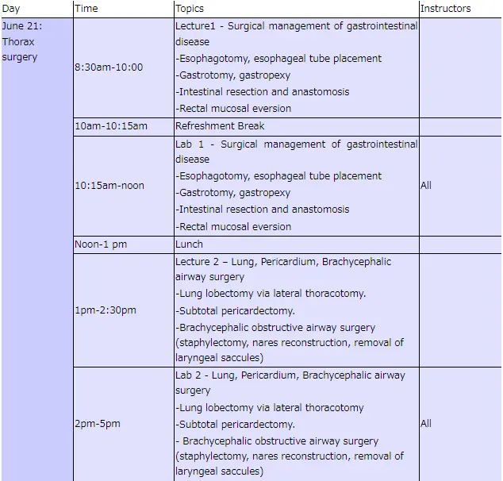
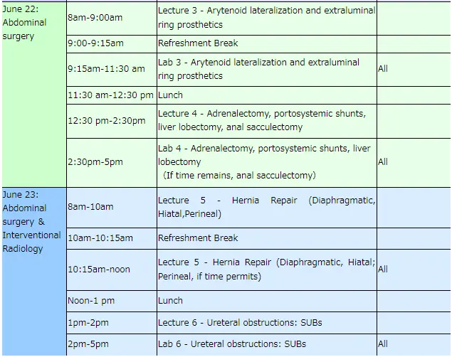

* Breakfast prepared in Oquendo Center.
* Dr. Komiyama/Dr. Pease: Pre-laboratory greetings. Greetings of the beginning lecture Dr.komiyama or/and Dr. Pease.
* Ending Ceremony: Picture and presentation of certificates

# 
講師紹介

#### 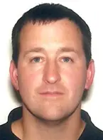
**
Dr.William Culp
**

Dr.William Culp先生は、カリフォルニア大学デービス校において外科の主任教授です。2004年にペンシルバニア大学獣医学校卒業後、同じ大学の内科と外科のレジデントを修了しました。その後、コロラド州立大学動物がんセンターにて腫瘍外科のフェローシップを修了し、米国の外科専門医となりました。
また、ニューヨークのアニマルメディカルセンターでインターベンショナル ラジオロジーのフェローシップに参加しました。
現在、彼はカリフォルニア大学デービスの軟部外科のチーフを務め、専門医3人と6人のレジデントを指導しています。軟部組織の手術の多くの分野に興味を持っておられますが、彼の主要な外科手術は軟部組織の腫瘍学およびインターベンショナル ラジオロジーです。

#### 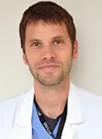
**
Dr. JAMES A. PERRY
**

Dr. JAMES A. PERRY先生は、現在ペンシルバニア大学の外科の助教授です。
専門は腫瘍に関するすべてですが、特に免疫学の腫瘍が研究テーマです。また先生は、腫瘍の内科の専門医でもあり、内臓外科特に腫瘍の外科の専門医でもあります。また獣医学博士（ＰｈＤ）でもあり、非常にめずらしい獣医学博士（ＰｈＤ）、外科専門医、内科の専門医のトリプルホルダーでもあります。
コロラド大学を2007年に卒業して、その1年後の2008年に獣医学博士（PhD）を取られました。3年程、外科の専門病院である、Aspen Meadow Veterinary Specialistsにて外科のレジデントとなり、2013年にはシアトルにある、Seattle Veterinary Specialistsにて外科の専門医として働きました。
先生が獣医学生へ寄せたアドバイスの言葉があるので、ここに記載します。「特にひとつの研究テーマを探究することに興味を持ったなら、獣医学のカリキュラムにうまく対応して、一生懸命に働くことである。この時期はもの凄い勢いで勉強することです。そして同僚と良きネットワークを構築しながら、あなたのキャリアを積んで行くことが重要です」。

#### 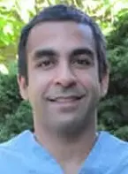
**
Dr. Ameet Singh
**

Dr. Ameet Singh先生は現在、オンタリオ大学の外科の助教授です。
先生の主な研究のテーマは、最小侵襲手術、細菌のバイオフィルム、手術部位の感染症の研究です。外科専門医です。