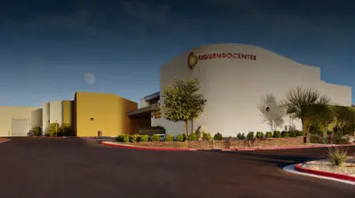

# WVC（西部獣医会議） 継続教育、オクエンドセンターでの実習ラボ

**2018.12.06-08開催セミナー終了報告** 
WVC（米国の西部獣医会議）主催による 
2018年度「WVC日本人のための獣医師外科実習セミナー」 

2018年12月次開催（12月6日-8日） 
Dr. Brian Bealeの日本人向け整形外科のすべて 
全3回シリーズの初回、Principles（プリンシパル） コース

**
12月開催セミナー終了いたしました。ご参加いただきありがとうございました。
**

3日間の実習がつつがなく終了致しました。参加者の皆様に感謝申し上げます。また後援各団体様、協賛各社様にも厚く御礼申し上げます。

### ＜WVC獣医師外科セミナーの特徴＞
1. 内閣府認定のNPO法人の企画・運営で営利を目的としていないこと。
2. 獣医師が管理し、獣医師が運営し、獣医師の団体が後援していること。
3. 後援する団体、協賛する各社のスポンサー方式を組織していること。
4. NPO法人ゆえに、利益目的でなく、参加費用をできるだけ低く設定していること。
5. セミナー申込金等の各種追加料金が発生しないこと。
6. 招聘の講師数は、3人体制で、参加者8人つき一人とオクエンドセンター基準に合致。
7. セミナー中にハンドアウトのPDF版を参加者にPDFにて配布。
8. セミナー最終日又は後日、使用したスライドのPDF版を参加者にPDFにて配布。
9. 講義前の予習用に講義の参考資料等を、可能な場合メールにて事前に配布。
10. 講義後の参加者に講義・実習等のDVDを、無料にて、終了1ヵ月後に配布。
11. 指定ホテルの場合は、WVCよりディスカウントコードが提供されます。
12. 指定の旅行会社により手数料各5400円にて飛行機、ホテル等の予約が可能。
13. 自身でも旅行社の選定ができ、公明正大で利権にとらわれない。
14. このWVCの海外セミナーには、申し込み金等の規定がありませんので、不必要。
15. 大学、専門病院等からインストラクターを招待して、実習の補助も行う予定。
16. 受講時間が72、120、168時間に達する当研究所認定の別の終了証書も予定。
17. 認定病院制度があり、参加回数や時間によって認定病院と認められます。

#### 

参加者に配布した講義・実習等のムービーDVD

# 概要
日 程 ：2018年12月6日（木）～12月8日（土） 
内 容 ：Dr. Brian Bealeの日本人向け整形外科のすべて、全3回シリーズの初回、
　　　　Principles（プリンシパル） コース、最大２８名様限定  
セミナー費用：258,000円 
　　　（実習に毎回プラスチックボーンを使用するため若干高め） 

#### 

主催：Western Veterinary Conference (WVC) 

企画&運営：特定非営利活動法人　小動物疾患研究所（理事長小宮山典寛） 

後援：有限会社スピリッツ HJS事務局、日本獣医救急医療研究会、日本獣医クリティカルケア＆マネージメント研究会 

特別協賛：株式会社 V and P（VetzPetz ）、ペットコミュニケーションズ株式会社 

協賛：テルコム株式会社 

講師／通訳： 
・Dr. Brian Beale（Gulf Coast Veterinary Specialists） 
・Dr Caleb Hudson （Gulf Coast Veterinary Specialists） 
・是枝哲彰先生（ 藤井寺動物病院 ） 
・通訳者：アララ クリスティーナ 直美 先生

# 内容詳細
**Dr. Brian Bealeの日本人向け整形外科のすべて、3回シリーズの初回**

コーディネーター　小宮山典寛

今回、特定非営利活動法人 小動物疾患研究所のセミナーは、講師の Dr. Brian Beale と是枝哲彰先生に何度も問い合わせて、十分に時間を掛け詳細に打ち合わせし企画しました。と言うのも、整形外科を学ぶ定番のコースに欧米では、AOVETと言うコースが存在します。AOコースは欧米の整形外科の定番であり、いわゆる整形外科で誰もが通るみちとも言われる整形外科の必須習得事項です。林慶先生曰く、欧米では、例えばTPLOをするのにAOVETを受けないで、いきなり始める獣医師は皆無とのことです。AOVETでは基礎コースである、Principlesから始まり、Advancesを終えて、Mastersと段階を追って進んで行く過程があります。

#### 
　そこで今回から、AOVETではありませんが、AOVETの講師の経験があり、日本の実情を知るDr. Brian Bealeに、3 回シリーズとして内容を組んでいただきました。このコースは、整形外科の基本から応用までを学ぶことができるコースです。今後3年間をかけて、Principles（プリンシパル）のコースから始まり、Advances（アドバーンス）コース、Masters（マスター）コースと順を追って開催する予定です。

この内容は AOVET の基本である、講義による解説と、AO と同様に、まずはプラスチックボーンを使用しての実習が組まれています。ここまでは普通の AO と変わりませんが、今回は Oquendo Center の特徴を生かして、AOVET の唯一の欠点とも言われている、プラスチックボーンでは学べない、実際の筋肉組織の剥離等が学べる、遺体を使用して実習します。まずはプラスチックボーンを使用して概要を理解してから、実際と同じように軟部組織のある遺体で行うというように、ダブルで実習していきます。これによりAOの欠点である、プラスチックボーンのみの実習ではなくなります。

　今回のプリンシパルのコースは、一見基本的なテクニックのように見えますが、これらの基本の正しいテクニックを学ばないで、例えばTPLO等を行うことは欧米では皆無と言われ、細かな技術の組み合わせでスクリューやプレートの緩み等の問題が起き5-10例に1例は手術が上手くいかないと言われています。

#### 
　多くの整形外科を取り扱う外科専門医曰く「手術が上手く行かない原因の多くは、基本的な技術の、小さなテクニックの組合せにある」とのことです。ピンニングやワイヤー、プレートロッドの正しい装着方法をこのセミナーで学ぶことができます。今回はじっくり基礎から応用まで正しい方法を学び、復習していきながら、症例を織り交ぜ、日本で遭遇する症例をも取り入れたプログラムになる予定です。また相談したい症例のX線等をご持参ください。
 
　「AOコース」はオクエンドセンターにて、既にAOVET主催、単独で年に数回行われていますが、当セミナーはAOVETとは完全に別のプログラムとなります。3年間に3回のコースで行いたいと思います。尚、日本のAOVETは来年の5月30日から6月2日まで「小動物の骨折管理の基礎」としてPrinciples（プリンシパル）のコースが泉澤康晴先生を中心として新横浜プリンスホテルで行われるようです。

#### 
　当コースは、整形外科の基本から応用までを学ぶことができるコースです。今後 3 年間をかけて、Principles（プリンシパル）のコースから始まり、Advances（アドバーンス）コース、Masters（マスター）コースと順を追って開催する計画です。ゆえに今回は Principles（プリンシパル）のコースとなりますが、骨折の治療技術の基本と応用、来年は、Advances（アドバーンス）となり特殊な骨折の治療技術と応用、最後の 3 年目の Masters（マスター）は関節疾患を中心に、Principles（プリンシパル）と Advances（アドバーンス）を習得した後の TPLO(脛骨高平部水平骨切り術)、難治性の膝蓋骨脱臼、前十字靭帯断裂と膝蓋骨内側の脱臼の合併症の治療を行う予定です。最終講師は、Dr. Brian Beale、Dr. Kei Hayashi（林慶先生）、是枝哲彰先生の 3 人の講師を予定しています。

　Dr. Brian Bealeは「原則としてPrinciplesを受けていない先生はAdvancesに出られない、Advancesに出ていない先生はMastersに出られないと言うAOVETの推奨がありますが、このぐらいの気持ちできちんと教育したい」と語っています。

#### 
　尚、特別に、この 3 回シリーズすべてに参加した獣医師に限り、特定非営利活動法人 動物疾患研究所より、Dr. Brian Bealeの署名入り「小動物整形外科の基本から応用」各 Principles、Advances、Masters コース、9日間の72 時間終了の「修了証書」を贈呈させて頂きます。

# プログラム
講師／通訳： 
* Dr. Brian Beale（Gulf Coast Veterinary Specialists） 
* Dr Caleb Hudson （Gulf Coast Veterinary Specialists） 
* 是枝哲彰先生（ 藤井寺動物病院 ） 
* 通訳者：アララ クリスティーナ 直美 先生

1. オクエンドセンターにて毎回、軽い朝食が用意されます。
1. 初日に夕食会（懇親会）を予定しています。
1. 最終日には授与式と記念写真が行われます。
1. プログラムの時間配分が少し変更になりました、5月24日現在内容には変更はありません。
1. オクエンドセンターにて毎回、軽い朝食が用意されます。
1. 講義の初めにDr.ピース又は小宮山からのご挨拶があります。
1. 初日に夕食会（懇親会）を予定しています。
1. 最終日には授与式と記念写真が行われます。

参考までに、下記は英文のスケジュール表です。

* Breakfast prepared in Oquendo Center.
* Ending Ceremony: Picture and presentation of certificates

# 
講師紹介

#### 
**
Dr. Brian Beale
**

1985年にフロリダ大学にてD.V.Mを取得。その後、フレンドシップホスピタルにてインターン、 フロリダ大学にて外科のレジデンス、そして1991年に外科専門医療を摂取し、フロリダ大学獣医学部の助教授となり、1992年にGulf coast veterinary specialistsに所属し、現在はテキサスA&M大学獣医学部の非常勤助教授でもある。彼は毎日曜日の夜の午後8時の番組のKTRH（AM740）にて、「あなたのペットの健康」でホストとして活躍している。また彼は世界の国際的な獣医学会議での招待講演者である。

#### 
**
Dr.Caleb Hudson
**

2007年にミズーリ大学を卒業し、獣医師となる。彼は2008年にフロリダ大学での研修期間を終えて、その後同大学にて、外科のレジデントとなり、2012年に修了した。そして2013年に獣医外科専門医の試験に合格した。そして同大学に残り臨床講師として活躍した、その後テキサス大学に移動し、その後Dr. Brian Bealeの居る、Gulf Coast Veterinary Specialists.の外科のチームに参加する。
彼の得意の分野は整形外科と軟部組織外科で、特に最小限侵襲的に関心を持つ。 Dr Caleb Hudsonは生粋のルイジアナ生まれである。

#### 
**
Dr.Tetsuaki Koreeda（是枝哲彰先生）
**

1992年に日本獣医生命科学大学を卒業、その後、獣医臨床病理学教室研究生へ、1998年に、大学院博士課程を終了、「犬の悪性組織球症に関する研究」にて獣医学博士、
1993年から1998年までIDEXXラボラトリーズにて、診断獣医師：細胞診、病理組織診断、
1998年に藤井寺動物病院に勤務、1999年にフロリダ大学ポストドクトラルフェロー、
2002年に藤井寺動物病院、動物人工関節センターの院長、動物臨床医学会、日本獣医画像診断学会の評議員、現在に至る。

# ＜参考＞2018年12月6-8日開催セミナーのモデル旅行プラン

今回12月のセミナーのための（仮）モデル旅行プランとして、東京発のスケジュールを幾つか記載します。

**セミナーの日程：2018年12月6日（木）～12月8日（土）　3日間**

※12月は予約が大変混み合っているようです。比較的、大韓航空が取りやすいようです。 
※日本からラスベガスまでのアクセスの方法は、ラスベガス大全をご参照ください。ちなみにラスベガスの国際空港は、マッカラン国際空港の1つのみです。 

* 最短パターン： 12月5日（水）～12月10日（月）　　6日間
* 基準パターン： 12月5日（水）～12月11日（火）　　7日間

**●最短パターンの6日間－ユナイテッド航空利用の場合**

＜行き＞ 
→12月5日、成田空港発16：55（UA 838）サンフランシスコ着 9：20 
→1時間40分後にサンフランシスコ発 11：00分（UA 358）ラスベガス着（当日の水曜日）12月5日12：29分 
→ホテルに各々チェック・インとなります。 
＜帰り＞ 
セミナー最終日の当日（セミナー終了後5時30分までに出れば間に合います）の8日 
→ラスベガス発19：41分（UA1232便）、サンフランシスコ着21：26分 
→サンフランシスコ発11：50分（UA837便）成田着（12月10日の月曜日）15:30分。 

この時期の運賃はエコノミークラスにて￥90,000-120,000円前後です。

**●基準パターンの7日間**

その1－デルタ航空利用ロサンゼルス経由の場合 

デルタ航空利用の7日間、ロサンゼルス経由のスケジュール例、80,000円前後と、安いが乗り継ぎ時間18時間あり。 

＜行き＞ 
→12月5日、東京(羽田)発19:20（DELTA 006）ロサンゼルス着12月5日12：42、 
→2時間38分後にロサンゼルス発15:00（DELTA 4148）ラスベガス着12月5日16：17 
＜帰り＞ 
→12月9日、ラスベガス発18:12（DELTA 1754）ロサンゼルス着19：28 
→ロサンゼルス発9：36（DELTA 007）東京(羽田)着15：20（翌日12月11日火曜日到着）以上です。 

その2－デルタ航空利用シアトル経由の場合 
デルタ航空利用の7日間、シアトル経由のスケジュール例、120,000円前後だが、乗り継ぎ1時間で便利 

＜行き＞ 
→12月5日、東京(成田)発17：20（DELTA 166）シアトル着12月5日9：36、 
→2時間後にシアトル発11：25（DELTA 2860）ラスベガス着12月5日13：58 
＜帰り＞ 
→12月9日、ラスベガス発07：40（DELTA 2579）シアトル着10：33 
→シアトル発11：31（DELTA 167）東京(成田)着15：40（翌日12月10日月曜日到着）以上です。 

その3-大韓空港利用の場合 
大韓空港利用の7日間のスケジュール例、運賃は100,000円前後です。 

＜行き＞ 
→12月5日、東京(成田)発17:00（KE002）ソウル（仁川）着19：50、 
大阪（関空）発18:10（KE726）ソウル（仁川）着20：15、 
福岡発13:40（K746）ソウル（仁川）着15：10、5時間50分待って 
→ソウル（仁川）発21：00 （KE005）ラスベガス 着 15：15、12月5日 
→ラスベガス到着後、入国手続きを済ませ、タクシーにて各ホテルへ 

問題は帰国便でセミナー最終日の8日は土曜日で大韓航空は飛んでいません、大韓空港は週に月-水木金-日のみです。よって帰国はセミナーの終了の翌日の9日の夜間便になります。 
＜帰り＞ 
→12月9日（夜間便）、ラスベガス発 23：50（KE006、DL9035）ソウル（仁川）着06：15、12月11日 
→各々乗り換えて日本各地へソウル発9：55－東京着12：20、 
ソウル発09:00-（KE 723便）大阪（関空）着10：45、 
ソウル発4時間50分待って11：05発－福岡着12：30、 
すると日本の帰国日は12月11日（2日間加えて）となりますので、お間違いないように、ご確認をお願いいたします。ゆえに今回は大韓航空は利用しにくいと思われます。 

