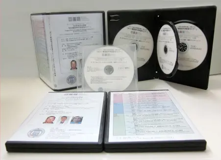
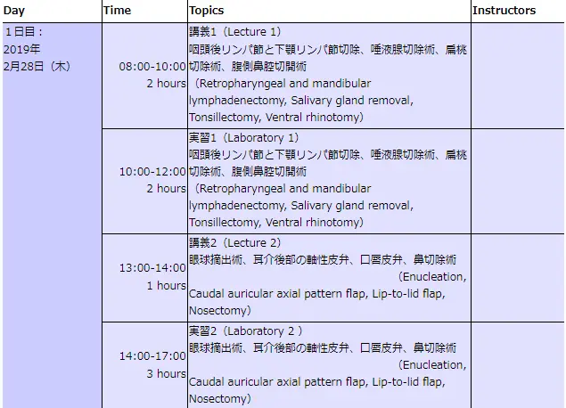
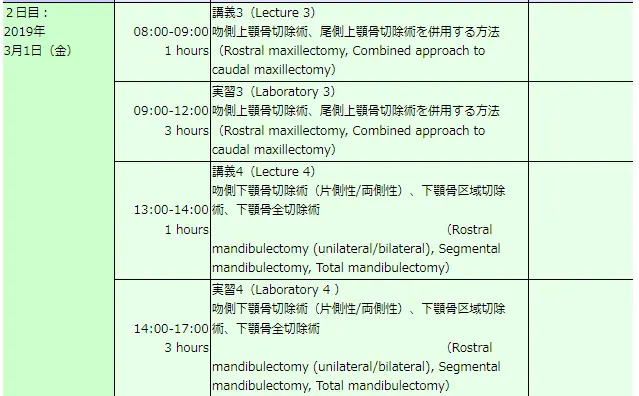
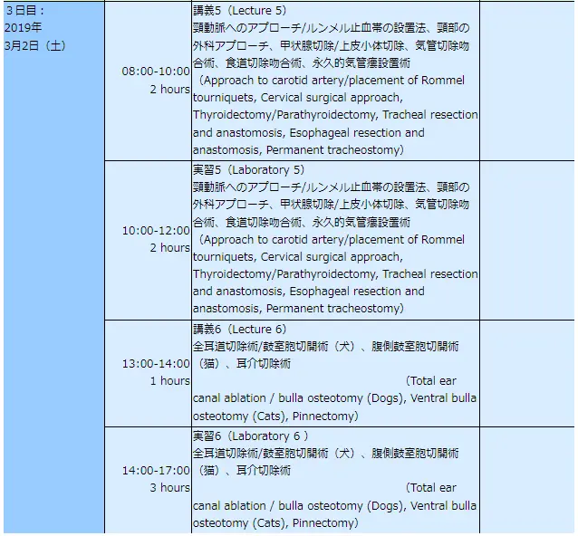
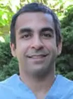
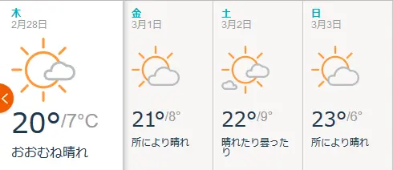

# Dr.William Culpの日本人向け頭部、頸部のマスターコース

**
2月開催セミナー終了いたしました。ご参加いただきありがとうございました。
**

日 程 ：2019年2月28日（木）～3月2日（土）　3日間 
内 容 ：Dr.William Culp （カルフォニア大学教授）の頭部、頸部のシリーズ 
セミナー費用：283,000円（26名様限定）―申込金等はWVCの規定によりありませんー

主催：Western Veterinary Conference (WVC) 

企画&運営：特定非営利活動法人　小動物疾患研究所（理事長小宮山典寛） 

後援：有限会社スピリッツ HJS事務局、日本獣医救急医療研究会、日本獣医クリティカルケア＆マネージメント研究会 

特別協賛：株式会社 V and P（VetzPetz ）、ペットコミュニケーションズ株式会社 

協賛：テルコム株式会社 

講師／通訳： 
・Dr.William Culp, VMD, DACVS（カリフォルニア大学デービス校の教授） 
・Dr. Jim Perry, DVM. phD ,ACVIM ,ACVS （ペンシルバニア大学、助教授） 
・Dr. Ameet Singh . BSc, DVM, DVSc, ACVS （オンタリオ大学の外科の助教授） 
・通訳者：久保田朋子先生

#### 

今回、参加者に配布した講義・実習を収録したDVDと 
予習復習用スライド・テキスト資料を収めたCD

# 内容詳細
**Dr.William Culp（カルフォニア大学教授） の日本人向け頭部、頸部シリーズ**

コーディネーター　小宮山典寛

　今回、特定非営利活動法人 小動物疾患研究所のセミナーはオクエンドセンターの実習の指導基準を守り、実習は参加者、原則的に8人につき1人の講師の原則を守り、3人を招聘しています。

#### 
　またこれらの海外の外科の実習セミナーに於いては、従来よりその特殊性から、セミナー自体が利権の構造となり、参加者が不利益を受ける（Dr. Brian Bealeが曰く、過去に米国の外科学会（ACVS）では実習セミナーを利権として、参加者に不利益になる、料金体系の業者を排除したとのことです）ことがないように、利益目的としない、内閣府認定のNPO（特定非営利活動）法人で開催しています。

Dr.William Culp,先生は、カリフォルニア大学デービス校の外科の主任の教授であり、腫瘍やインターベンショナルを得意しています。Dr. Jim Perry, 先生は、ペンシルバニア大学助教授で、特に免疫学の腫瘍が主な研究のテーマで、何と外科専門医と内科専門医の2つの専門医の資格を有しています。非常にめずらしいことに研究テーマの免疫の腫瘍で獣医学博士（ＰｈＤ）も併せ持ち、非常に珍しい、トリプルホルダーと称されています。またDr. Ameet Singh 先生はオンタリオ大学の外科の助教授で、最小侵襲手術、手術部位の感染症の細菌の研究をテーマにしています。
このような豪華メンバーを揃え、 3人が十分に時間を掛け、各々の持ち味を生かして、詳細に打ち合わせした企画で開催できる運びとなりました。すべて講義の後に実習があり、実習の前に講師のデモンストレーションがあります。これらのシステムにより効率的に学ぶことができます。

#### 
　初日の午前のテーマは犬の頸部に発生する腫瘍性の関連疾患として咽頭後リンパ節と下顎リンパ節切除、また唾液腺切除術に於いては、手術上重要な4対の主要な唾液腺（耳下腺、下顎腺、舌下腺、頬骨腺）の解剖を学びながら、知らなければならない手術のコツを学びます。片側又は両側の腫大した扁桃、非反応性の慢性扁桃炎その他、腫瘍の際の扁桃切除術の注意点、また意外と知られていない鼻の中の腫瘍で知らないとできない、腹側鼻腔切開術を学びます。
　初日の午後のテーマは、適応が多い眼球摘出術、以外に適用がある、耳介後部の軸性皮弁（皮膚移植）、口唇の形を変えるために行われる口唇皮弁、また比較的珍しい鼻切除術の正しいアプローチを学びます。
 
　2日目の午前は、上顎骨の一部を除去する手術である、吻側上顎骨切除術、尾側上顎骨切除術を併用する方法を今回は学びます。これらの手術においては、損傷の少ないテクニックは、組織損傷を減じて、急速な治癒を促進する方法について、学べます。
　午後は、下顎骨の一部を除去する手術である、吻側下顎骨切除術（片側性/両側性）、下顎骨区域切除術、下顎骨全切除術のすべてを同時に学びます。これらの上顎と下顎の手術を同時に学ぶと、非常に判りやすく理解できます。

　最終日は今回のテーマである頸部の手術で、午前中は、頸動脈へのアプローチ/ルンメル止血帯の設置法、頸部の外科アプローチの代表的な手術である、甲状腺切除/上皮小体切除、気管切除吻合術、食道切除吻合術、永久的気管瘻設置術等、所謂頸部の手術で知らねばならない手術のエキスを纏めて学ぶこととなります。
　午後は、各々の犬猫の適応を分けて、犬の全耳道切除術/鼓室胞切開術、猫の腹側鼓室胞切開術を学びます。犬猫の注意点の違いも学べます。そして耳介切除術の必要なテクニックですので、同時に学びます。

#### 
#### 

# プログラム
頭頸部の外科手術－Head and Neck Surgery－

1. オクエンドセンターにて毎回、軽い朝食が用意されます。
1. 初日に夕食会（懇親会）を予定しています。
1. 最終日には授与式と記念写真が行われます。

# 
講師紹介

#### 
**
Dr.William Culp
**

Dr.William Culp先生は、カリフォルニア大学デービス校において外科の主任教授です。2004年にペンシルバニア大学獣医学校卒業後、同じ大学の内科と外科のレジデントを修了しました。その後、コロラド州立大学動物がんセンターにて腫瘍外科のフェローシップを修了し、米国の外科専門医となりました。
また、ニューヨークのアニマルメディカルセンターでインターベンショナル ラジオロジーのフェローシップに参加しました。
現在、彼はカリフォルニア大学デービスの軟部外科のチーフを務め、専門医3人と6人のレジデントを指導しています。軟部組織の手術の多くの分野に興味を持っておられますが、彼の主要な外科手術は軟部組織の腫瘍学およびインターベンショナル ラジオロジーです。

#### 
**
Dr. JAMES A. PERRY
**

Dr. JAMES A. PERRY先生は、現在ペンシルバニア大学の外科の助教授です。
専門は腫瘍に関するすべてですが、特に免疫学の腫瘍が研究テーマです。また先生は、腫瘍の内科の専門医でもあり、内臓外科特に腫瘍の外科の専門医でもあります。また獣医学博士（ＰｈＤ）でもあり、非常にめずらしい獣医学博士（ＰｈＤ）、外科専門医、内科の専門医のトリプルホルダーでもあります。
コロラド大学を2007年に卒業して、その1年後の2008年に獣医学博士（PhD）を取られました。3年程、外科の専門病院である、Aspen Meadow Veterinary Specialistsにて外科のレジデントとなり、2013年にはシアトルにある、Seattle Veterinary Specialistsにて外科の専門医として働きました。
先生が獣医学生へ寄せたアドバイスの言葉があるので、ここに記載します。「特にひとつの研究テーマを探究することに興味を持ったなら、獣医学のカリキュラムにうまく対応して、一生懸命に働くことである。この時期はもの凄い勢いで勉強することです。そして同僚と良きネットワークを構築しながら、あなたのキャリアを積んで行くことが重要です」。

#### 
**
Dr. Ameet Singh
**

Dr. Ameet Singh先生は現在、オンタリオ大学の外科の助教授です。
先生の主な研究のテーマは、最小侵襲手術、細菌のバイオフィルム、手術部位の感染症の研究です。外科専門医です。

### ＜WVC獣医師外科セミナーの特徴＞
1. 内閣府認定のNPO法人の企画・運営で営利を目的としていないこと。
2. 獣医師が管理し、獣医師が運営し、獣医師の団体が後援していること。
3. 後援する団体、協賛する各社のスポンサー方式を組織していること。
4. NPO法人ゆえに、利益目的でなく、参加費用をできるだけ低く設定していること。
5. セミナー申込金等の各種追加料金が発生しないこと。
6. 招聘の講師数は、3人体制で、参加者8人つき一人とオクエンドセンター基準に合致。
7. セミナー中にハンドアウトのPDF版を参加者にPDFにて配布。
8. セミナー最終日又は後日、使用したスライドのPDF版を参加者にPDFにて配布。
9. 講義前の予習用に講義の参考資料等を、可能な場合メールにて事前に配布。
10. 講義後の参加者に講義・実習等のDVDを、無料にて、終了1ヵ月後に配布。
11. 指定ホテルの場合は、WVCよりディスカウントコードが提供されます。
12. 指定の旅行会社により手数料各5400円にて飛行機、ホテル等の予約が可能。
13. 自身でも旅行社の選定ができ、公明正大で利権にとらわれない。
14. このWVCの海外セミナーには、申し込み金等の規定がありませんので、不必要。
15. 大学、専門病院等からインストラクターを招待して、実習の補助も行う予定。
16. 受講時間が72、120、168時間に達する当研究所認定の別の終了証書も予定。
17. 認定病院制度があり、参加回数や時間によって認定病院と認められます。

#### 

今回、参加者に配布した講義・実習を収録したDVDと 
予習復習用スライド・テキスト資料を収めたCD

# ＜参考＞2019年2月28日～3月2日のWVCセミナーのモデル旅行プラン

#### 

今回2月のセミナーのための（仮）モデル旅行プランとして、東京発のスケジュールを幾つか記載します。

**セミナーの日程：2019年2月28（木）日から3月2日（金）まで**

※日本からラスベガスまでのアクセスの方法は、<a href="https://www.lvtaizen.com/">ラスベガス大全</a>をご参照ください。ちなみにラスベガスの国際空港は、マッカラン国際空港の1つのみです。

**最短パターン： 2月27日（水）～3月4日（月）　6日間** 
**基準パターン： 2月27日（水）～3月5日（火）　7日間**

**●最もお勧めの7日間の基準パターン**

大韓航空の利用（この時期の適正な公示運賃は100,000円前後です）大韓空港は週に月-水木金-日のみです。火曜日と土曜日は飛んでいません。よって帰国はセミナーの終了の翌日の3日の夜間便（日付が変わる10分前）になります。

**＜行き＞出発日2月27日（水）東京→ラスベガス **
東京(成田)<KE002>17：00→ソウル(仁川)19：50 
名古屋(中部)<KE-742>3：40→ソウル(仁川)15：50 
大阪(関西)<KE-726>18：10→ソウル(仁川)20：10 
福岡<KE-790>15：40→ ソウル(仁川)17：10 
→ソウル(仁川)<KE005>21：00 →ラスベガス15：15 
**＜帰り＞帰国日3月3日（日）ラスベガス→東京（日本帰国日は3月5日） **
ラスベガス<KE006>22：50→ソウル(仁川)05：15（+2日）05：15 
ソウル(仁川)<KE703>09：55→東京(成田)12：20 
ソウル(仁川)<KE-741>09：00→名古屋(中部)10：55 
ソウル(仁川)<KE-723>09：00→大阪(関西)10：45 
ソウル(仁川)<KE-787>08：00→福岡09：20 

**●最短パターンの6日間－ユナイテッド航空利用の場合、約84000円前後**

**＜行き＞ **
→2月27日、成田空港発16：55（UA 838）サンフランシスコ着9：20 
→1時間30分後にサンフランシスコ発 10：50（UA 358）ラスベガス着（当日の水曜日）2月27日 12：20、
ターミナル3に到着、→ホテルに各々チェック・インとなります。 
**＜帰り＞ **
→3月3日、ラスベガス発07：28分（UA834便）、サンフランシスコ着09：15、 
サンフランシスコ発11：00（ANA NH007便）成田着（3月4日月曜日）15:20 

**●最短パターンの6日間－デルタ航空利用のロサンゼルス経由、約95000円前後**

**＜行き＞ **
→2月27日、東京(羽田)発19：20（DL005便）→ロサンゼルス着12：51、 
2時間9分待って、ロサンゼルス発15：00→ラスベガス着16：15（DL3542便）ターミナル1 
**＜帰り＞ **
→12月9日、ラスベガス発07：40（DELTA 2579）→シアトル着10：33 
→シアトル発11：31（DELTA 167）→東京(成田)着15：40（翌日12月10日月曜日到着） 
以上です。

旅行の特別手配について
日本からラスベガスへ行く、旅行に関して、飛行機の予約とホテルの予約、 海外旅行保険 、ESTA等（希望者のみ） については、大手の 新常磐交通 ㈱ 観光事業部・東京支店（JKKコミュニケーションズ）の 今田明博さんを御紹介いたします。航空券は公示運賃での価格（航空会社のホームページの案内と同じ価格）ですので安心です。ご希望の先生はお申込みください。

* ご参考までに、飛行機予約際は、使用する飛行機会社のホームページからの予約が概して最も安いようですし、アップグレード等しやすいことがあります。最近は便数を減らしているせいか、予約はなかなか取りにくいようです。決まりましたら早急に予約をすることをお勧めします。なお各社の飛行機の運航状況を把握するには、「エアトリ」で調べると判りやすいと思います。参考までにラスベガス行きの予約の為の、空港会社のホームページを記載します。マイレージカード番号をお持ちの方は便利に予約できます。お持ちでない方はあらかじめ取得するか、搭乗時に言って、帰国後に取得してください。

* なお米国に到着したら、最初の乗り換え便の場所で、機内に入れた荷物はターンテーブルから自身で取り出し税関を通過後、乗り継ぎ便のチェックインカウンターにお預けください。空港等で何か困ったら、遠慮なく相談しましょう、わからなければ「Does anyone speak Japanese?―日本語を話せる人はいますか？」と聞きましょう。最も重要なことは、その解決策を「Do you have any idea ?」と聞くことです。

* デルタ空港（スカイチーム加盟）予約電話0570-077-7333、米国からの電話1-800-241-4141　
* ユナイテッド航空（スターアライアンス加盟）予約電話　03-6732-5011、米国からの電話 1-800-864-8331 マイレージプラス・サービスセンター 03-6732-5022
* 日本航空（ワンワールド加盟）予約電話 0570-025-031
* 大韓航空（スカイチーム加盟）予約電話　0088-21-2001又は(06) 6264-3311
* ANA（スターアライアンス加盟）マイレージ専用　0570-029-767 会員外　0570-029-333
* エア・カナダ（スターアライアンス加盟）予約電話03-5405-8800 又は0120-048-048
* ハワイアン（スカイチーム加盟）予約番号　0570-018-011

**ラスベガス旅行に関する有益なホームページ**

* <a href="https://www.visitlasvegas.com/ja/">ラスベガス観協会</a>
* <a href="https://tenki.jp/world/7/92/72386/">ラスベガス(アメリカ)の天気 - 日本気象協会</a>
* <a href="https://www.lvtaizen.com/">ラスベガス大全</a>
* <a href="https://www.lvtaizen.com/hotel/index.html">ラスベガスのホテル予約に関する最新情報と、予約サイトの見分け方</a>
* <a href="https://travel.rakuten.co.jp/mytrip/howto/airplane">快適なご旅行を！飛行機内での過ごし方・暇つぶし方法飛行機での快適な過ごし方</a>
* <a href="https://www.expedia.co.jp/stories/%e9%95%b7%e6%99%82%e9%96%93%e3%81%ae%e3%83%95%e3%83%a9%e3%82%a4%e3%83%88%e3%82%92%e5%bf%ab%e9%81%a9%e3%81%ab%e9%81%8e%e3%81%94%e3%81%99%e3%83%af%e3%82%b6/">長時間のフライトを快適に過ごす裏ワザ</a>
* <a href="http://www.ryokojoho.jp/link/">海外旅行専門情報サイト 旅行情報.jp 海外旅行関連リンク</a>

#### 

ラスベガスの天気、<a href="https://www.accuweather.com/ja/us/las-vegas/89101/weather-forecast/329506">AccuWeatherより転載</a>

ラスベガスの気候は、ほとんどが年間を通じて快適です。年間平均310日毎日が晴天、年間を通じて殆ど雨の日はありません。しかし夏は暑く、7月には日中の平均気温が摂氏40.1度（華氏104.2度）にもなる一方、冬は短く、気候も穏やかで12月の平均気温は摂氏10度（華氏50度）台半ばくらいです。

華氏から摂氏の変換式は、°C = 5 / 9 (°F - 32)ですが、覚えにくいので、簡単に、°C =（°F - 30）÷ 2つまり、「30引いて、2で割る」だけ。しかし1-2℃の誤差はあります。「ローマへ行こう」と覚えます。ローマ（60） ＝ イコー（15）。つまり、60°Fと15°Cは等しいという事です。あとは華氏が10°F増減する度に、摂氏を5°C増減させてやれば、だいたいの気温が計算できます。

