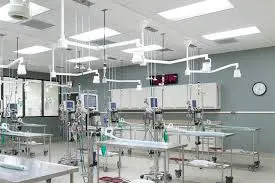
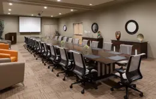

# Dr. Brian Bealeの整形外科セミナー全3回シリーズの２回目Advances（アドバーンス）コース 開催概要

**
2019年12月9日-11日開催セミナーは2020年9月開催へ延期になりました。
**

<small style="color:#040404;">
※この回のセミナーは2020年9月7日（月）-9日（水）に内容を変えて行います。
</small>

日 程 ：2019年12月9日（月）～12月11日（水）　3日間 
内 容 ：Dr. Brian Bealeの日本人向け整形外科のすべて、全3回シリーズの２回目、 
Advances（アドバーンス）コース、最大28名様限定 
セミナー費用：278,000円―申込金はWVCの規定にありません

主催：Western Veterinary Conference (WVC) 

企画&運営：特定非営利活動法人　小動物疾患研究所 

後援：有限会社スピリッツ HJS事務局、日本獣医救急医療研究会、日本獣医クリティカルケア＆マネージメント研究会 

特別協賛：株式会社 V and P（VetzPetz ）、ペットコミュニケーションズ株式会社 

協賛：テルコム株式会社 

講師／WVCの規定に準じて講師は3名： 
・Dr. Brian Beale（Gulf Coast Veterinary Specialists） 
・Dr Caleb Hudson （Gulf Coast Veterinary Specialists） 
・是枝哲彰先生（ 藤井寺動物病院 ） 
・通訳者：久保田朋子先生

お申込締切日：最終締め切り 2019年12月4日（月）

## 内容詳細
**Bealeの日本人向け整形外科のすべて、3回シリーズの二回目**

#### 
コーディネーター　小宮山典寛

　今回、特定非営利活動法人 小動物疾患研究所のセミナーはオクエンドセンターの実習の指導基準を守り、実習は参加者、原則的に8人につき1人の講師の原則を守り、3人を招聘しています。

　またこれらの海外の外科の実習セミナーに於いては、従来よりその特殊性から、セミナー自体が利権の構造となり、参加者が不利益を受ける（Dr. Brian Bealeが曰く、過去に米国の外科学会（ACVS）では実習セミナーを利権として、参加者に不利益になる、料金体系の業者を排除したとのことです）ことがないように、利益目的としない、内閣府認定の<a href="https://www.npo-homepage.go.jp/npoportal/detail/013010784">NPO（特定非営利活動）法人 </a> で開催しています。

　今回のセミナーの内容は、講師の Dr. Brian Beale に何度も問い合わせて、十分に時間を掛け詳細に打ち合わせし企画しました。と言うのも、整形外科を学ぶ定番のコースに欧米では、AOVETと言うコースが存在します。AOコースは欧米の整形外科の定番であり、いわゆる整形外科で誰もが通るみちとも言われる整形外科の必須習得事項だからです。林慶先生曰く、欧米では、例えばTPLOをするのにAOVETを受けないで、いきなり始める獣医師は皆無とのことです。AOVETでは基礎コースである、Principlesから始まり、Advancesを終えて、Mastersと段階を追って進んで行く過程があります。

#### 
　そこで今回から、AOVETではありませんが、AOVETの講師の経験があり、日本の実情を知るDr. Brian Bealeに、3 回シリーズとして内容を組んでいただきました。このコースは、整形外科の基本から応用までを学ぶことができるコースです。昨年Principles（プリンシパル）のコースが終わり、今年はAdvances（アドバーンス）コースとなります。来年（2020年）は完成編のMasters（マスター）コースです。
 
　　この内容は AOVET の基本である、講義による解説と、AO と同様に、初めにプラスチックボーンを使用しての実習が組まれています。ここまでは普通の AO と変わりませんが、当コースは Oquendo Center の特徴を生かして、AOVET の唯一の欠点とも言われている、プラスチックボーンでは学べない、実際の筋肉組織の剥離等が学べる、遺体を使用して実習します。 
**まずはプラスチックボーンを使用して概要を理解してから、実際と同じように軟部組織のある遺体で行うというように、ダブルで実習していきます。** これによりAOの欠点である、プラスチックボーンのみの実習ではなくなります。

　今回のアドバーンスコースは、基本的なテクニック＋αの応用編です。これらの基本の正しいテクニックを学んでから、細かな技術の組み合わせにて手術を行えば、スクリューやプレートの緩み等の問題が起きる確率がかなり軽減されます。

#### 
　多くの整形外科を取り扱う外科専門医曰く「手術が上手く行かない原因の多くは、基本的な技術の、小さなテクニックの組合せにある」とのことです。ピンニングやワイヤー、プレートロッドの正しい装着方法をこのセミナーの応用編で学ぶことができます。基礎から応用まで正しい方法を学び、復習していきながら、症例を織り交ぜ、日本で遭遇する症例をも取り入れたプログラムになる予定です。また相談したい症例のX線等をご持参ください。

　「AOコース」はオクエンドセンターにて、既にAOVET主催、単独で年に数回行われていますが、当セミナーはAOVETとは完全に別のプログラムとなります。

#### 
このAdvances（アドバーンス）は特殊な骨折の治療技術と応用ですが、最後の 3 年目の Masters（マスター）は関節疾患を中心に、Principles（プリンシパル）と Advances（アドバーンス）を習得した後の TPLO(脛骨高平部水平骨切り術)、難治性の膝蓋骨脱臼、前十字靭帯断裂と膝蓋骨内側の脱臼の合併症の治療を行う予定です。講師は同じ、Dr. Brian Beale、Dr Caleb Hudson、是枝哲彰先生の3名の先生方を予定しています。

　尚、特別に、この 3 回シリーズすべてに参加した獣医師に限り、特定非営利活動法人 動物疾患研究所より、Dr. Brian Bealeの署名入り「小動物整形外科の基本から応用」各 Principles、Advances、Masters コース、9日間の72 時間終了の「修了証書」を贈呈させて頂きます。

## プログラム
*Bealeの日本人向け整形外科のすべて、3回シリーズの二回目Advances（アドバーンス）コース *

1. オクエンドセンターにて毎回、軽い朝食が用意されます。
1. 初日に夕食会（懇親会）を予定しています。
1. 最終日には授与式と記念写真が行われます。

## 
講師紹介

#### 
**
Dr. Brian Beale
**

1985年にフロリダ大学にてD.V.Mを取得。その後、フレンドシップホスピタルにてインターン、 フロリダ大学にて外科のレジデンス、そして1991年に外科専門医を摂取し、フロリダ大学獣医学部の助教授となり、1992年にGulf coast veterinary specialistsに所属し、現在はテキサスA&M大学獣医学部の非常勤助教授でもある。彼は毎日曜日の夜の午後8時の番組のKTRH（AM740）にて、「あなたのペットの健康」でホストとして活躍している。また彼は世界の国際的な獣医学会議での招待講演者である。

#### 
**
Dr.Caleb Hudson
**

2007年にミズーリ大学を卒業し、獣医師となる。彼は2008年にフロリダ大学での研修期間を終えて、その後同大学にて、外科のレジデントとなり、2012年に修了した。そして2013年に獣医外科専門医の試験に合格した。そして同大学に残り臨床講師として活躍した、その後テキサス大学に移動し、その後Dr. Brian Bealeの居る、Gulf Coast Veterinary Specialists.の外科のチームに参加する。
彼の得意の分野は整形外科と軟部組織外科で、特に最小限侵襲的に関心を持つ。 Dr Caleb Hudsonは生粋のルイジアナ生まれである。

#### 
**
Dr.Tetsuaki Koreeda（是枝哲彰先生）
**

1992年に日本獣医生命科学大学を卒業、その後、獣医臨床病理学教室研究生へ、1998年に、大学院博士課程を終了、「犬の悪性組織球症に関する研究」にて獣医学博士、
1993年から1998年までIDEXXラボラトリーズにて、診断獣医師：細胞診、病理組織診断、
1998年に藤井寺動物病院に勤務、1999年にフロリダ大学ポストドクトラルフェロー、
2002年に藤井寺動物病院、動物人工関節センターの院長、動物臨床医学会、日本獣医画像診断学会の評議員、現在に至る。

### ＜WVC獣医師外科セミナーの特徴＞
1. 内閣府認定のNPO法人の企画・運営で営利を目的としていないこと。
2. 獣医師が管理し、獣医師が運営し、獣医師の団体が後援していること。
3. 後援する団体、協賛する各社のスポンサー方式を組織していること。
4. NPO法人ゆえに、利益目的でなく、参加費用をできるだけ低く設定していること。
5. セミナー申込金等の各種追加料金が発生しないこと。
6. 招聘の講師数は、3人体制で、参加者8人つき一人とオクエンドセンター基準に合致。
7. セミナー中にハンドアウトのPDF版を参加者にPDFにて配布。
8. セミナー最終日又は後日、使用したスライドのPDF版を参加者にPDFにて配布。
9. 講義前の予習用に講義の参考資料等を、可能な場合メールにて事前に配布。
10. 講義後の参加者に講義・実習等のDVDを、無料にて、終了1ヵ月後に配布。
11. 指定ホテルの場合は、WVCよりディスカウントコードが提供されます。
12. 指定の旅行会社により手数料各5400円にて飛行機、ホテル等の予約が可能。
13. 自身でも旅行社の選定ができ、公明正大で利権にとらわれない。
14. このWVCの海外セミナーには、申し込み金等の規定がありませんので、不必要。
15. 大学、専門病院等からインストラクターを招待して、実習の補助も行う予定。
16. 受講時間が72、120、168時間に達する当研究所認定の別の終了証書も予定。
17. 認定病院制度があり、参加回数や時間によって認定病院と認められます。

#### 

過去のセミナーにて、参加者に配布した講義・実習等のムービーDVD

## WVC主催のセミナーとは－

この<a href="https://www.viticusgroup.org/">WVC（西部獣医会議）</a>の施設内であるオクエンドセンターで行う、外科の実習セミナーは過去にも私がコーディネートし行って来た経緯がありますが、WVCに参加した獣医師の有志から、**兎角海外セミナーに在りがちな利権とならないように、より広く公開し、より進化した形で、セミナーの無駄を省き、より効果的に、獣医師が主体となり誰もが参加しやすい形式で行うことが出来ないか**と相談されたのを契機に、私は<a href="https://kotowaza-dictionary.jp/k1071/">ルビコン川を渡る決意</a>をしました。そして、その方式はNPO方式ならば、公明正大に行えるであろうと考え、発足させたものです。

#### 

この米国のラスベガスで行われるWVC（西部獣医会議）は現在米国で最大規模の獣医師の団体であり、毎年3月に年次大会が行われております。また、この「WVC獣医師外科セミナー」はWVCの継続教育の一環として、日本人獣医師のために、英語での講演の場合は、日本語の通訳付きで行われるものです。この施設は獣医学教育（大学を除いて）においては、全米唯一の教育のための専門の組織（ゆえにネバタ州の獣医師免許の試験会場に指定）、**ＷＶＣの厳格な動物倫理の基準（安楽死された遺体を使用等）に沿って運営され、且つ獣医学の安全対策に配慮して運営**されています。

#### 

外科手術の実習セミナーは、ラスベガスと言う地の利を生かし、過去20年以上の実習の経験を生かして、設備の充実性、実習に使用する医療機器の充実性、参加者の安全性、医療スタッフの充実、学ぶ環境、検体の扱いと衛生管理、講師の選定と人数、その実習の評価と判定、今後の発展性等あらゆる面で充実している、**米国の西部獣医会議の施設の特徴を生かして、**日本の獣医師自身が何を知りたいか？何を学びたいか？を追求し、生涯教育プログラムを選定して、新たに展開してまいります。

　そのため、この講義の内容は吟味され、知らねばならない**基本的な手術の復習と応用、比較的珍しい手術、新しい革新的な手術等を、織り交ぜて構成されています。**講師の選定にあたっては、米国獣医師会認定の外科専門医は現在2004人（2017年度報告）いますが、その中から選りすぐった約300人の登録リストの中から主に選ばれています。

　また実習の際の講師の人数についても、WVCの基準である講師数は、理想的には参加者8人につき1人の講師であり、24人以上の参加者には3人以上の講師が必要とのＷＶＣの見解があります。

　例えば講師数を3人ではなく2人とし、実習時間を少し短くし、参加人数を20人程度にすれば、それだけ参加費用は安くなるでしょうが、その場合に問題となるのは、実習の際の指導教官の数で、日本から別に派遣する等の必要が生じるでしょう。現在では私たちはこのような形態でできる低価格帯のセミナーは行っていません。

#### 

　実験の際、各テーブルの参加者は2人が原則です。しかし参加者が奇数の場合は1人テーブルになることもあるかもしれません。また参加希望者があまりに多い場合は、一部のテーブルで3人となりうる可能性がありますが、そのような場合は原則、頭数を余分に用意するように要請します。

今後行われる、この新しいセミナーの特徴は、Not-for profit Organization すなわち特定非営利活動法人（内閣府認定のNPO方式）で行われることです。これにより、**本来のあるべき理想的な海外研修セミナーの実現を目指します。**

**このセミナーは旅行会社を介さないので、旅行の手配（フライト及びホテル）はインターネット等にてご自身で手配するか**、ご自身で知り合いの旅行会社又は推薦する旅行会社（後ほど記載）にて手配をお願いいたします。特に自身の手配の場合は、パスポート及び<a href="https://traveltale.net/esta-shinsei/">電子渡航認証システム(ESTA)</a>の有効期間（2年間）の確認をお願いします。

エスタ(ESTA)の申請について、米国大使館（料金はクレジットカードの支払いにて$14.00）で申告できます。インターネット上には、多くの私営のサイトがありますが、
**問題となるのは、プラバシーです。** まったく知らない所に、普通では知りえない自身のプライバシー（パスワード番号等の個人情報の問題）を、すべて託すことになります。問題は米国大使館のESTA公式サイトと似せてあることで、間違わないようにご注意ください。

　自身で行えば数分で申告が終了します。代行サイトは数分ではできずに数日かかります。ネットでは申告が受理されても、されなくても報告がなかったりして（自身で調べること）トラブルが多いようです。

ゆえにESTAの代行は原則、クレジットカードを持参していない方（友達に頼める？）のみが原則でしょう。しかしその場合の依頼は**大手の旅行会社（セキュリティーの問題にて）が原則**でしょう。通常旅行社では手数料（3500円前後）はかかりますが、ネットより手配の旅行会社の方が、全てがスムースに行くようです。

　エスタを得ていないと、搭乗手続きの際に、コンピューター持参していますか？今すぐに申告してください。ESTAないと搭乗できませんと言われます。故に以前から良く言われるように、何があるか判りません（交通の遅延も含めて）ので
**海外旅行は飛行機の出発時間の少なくても2時間以上前には空港に着いていることが原則です** また、任意海外旅行傷害保険等の有無はご自身でご検討ください。

　インターネットでの予約の際には、概して、
**円建て税込み表示**などホテル予約専門サイトで予約した方が安い可能性があります。また一部の予約サイト（例えばTrip.com）では、キャンセルできない予約の場合は、ホテルの料金は通常の約半額（数が限定）となる場合もあります。またこれらの予約サイトは、ホテルと飛行機を共に予約すると割引がある場合もある一方、別々の方が割安の場合もあります。ゆえに、両方調べる方が良いと思います。

　またTripAdvisorのサイト等は一度検索すると、その後に「こちらのホテルのさらにお安い料金を見つけました」と案内（閲覧履歴による）が入ることもあります。またこれらのサイトの、口コミ情報は役立つこともありますが、少し煩わしいかもしれません。

　予約の際には、バスタブ等を希望する場合は記載（Do you have a room with a bathtub and a shower.）することをお勧めします。このように自己責任ですが、自身で予約した場合は自由度が高く、旅行会社によってはそこまで対応しない場合があるからです。ホテルの予約の際には、特別なディスカウントコードがない限り、そのホテル自体のホームページと予約専門のホームページの2つ以上を比べることをお勧めします。

#### 

　日本発のラスベガス着のフライトですが、現在は直行便はありません、乗り継ぎ便のみです。1回乗り継ぎと2回乗り継ぎ（より安いが面倒、しかし予約しやすい）があります。経由はいろいろあるようですが、デルタ航空（ロサンゼルス、ミネアポリス、シアトル、ソルトレーク経由）、日本航空（サンフランシスコ、ホノルル経由）、ANA（ロサンゼルス、ホノルル経由）、大韓航空（仁川経由、火土運休）、アメリカン航空（ロスアンゼルス経由）、ハワイアン航空（ホノルル経由）、エア・カナダ（バンクーバー経由）等が便利に利用できるようです。

取りあえず、日本からラスベガスまでのアクセスの方法は<a href="https://www.lvtaizen.com/">ラスベガス大全</a>をご参照ください。**飛行機の予約の際の運賃についての基本は「公示運賃」です。**これは各々の航空会社がホームページに記載している料金（期間限定の特別料金は除く）のことです。

　これはあくまで基本の料金ですので、予約（知り合いの旅行会社に頼む）する際は、公示運賃を参考にして必ずお調べください。
**旅行会社によっては、各々の料金を公開せず、ホテル料金、運賃、雑費、手数料と抱き合わせにして、意図的に料金を判らないようにしていて、何かにつけ、本来含まれている料金とは別に、各々に手数料を請求する会社もあるようです**から、注意が必要です。また別に申し込み金の有無をお確かめください。総額がいくらになるのか？確かめる必要があるでしょう。 通常はあり得ない事でしょうが、旅行会社によっては、いろいろな料金を小刻みにして、追加料金と称して加算したり、各々の料金、例えばホテル代等を公表せずに、他の料金と合算して判らないようにする旅行社もあるようなので注意が必要でしょう。また航空運賃の場合も、パック旅行の場合には、公示価格より20-30%の割増の場合もあり、注意が必要です。

　原則的には現地集合、現地解散ですが、指定のホテルの場合は、セミナーの参加者に限り、WVCから
**特別な割引（デイスカウント・コード）が提供**されますので、御利用ください。また指定ホテルでは送迎バスを予定しています。 各々の確認は電話やメールにて連絡を取り合いながら、セミナーを充実させていきたいと思います。

　ラスベガスのホテルの予約についてですが、米国のホテルは御存知だと思いますが、1部屋単位（通常2人まで）の料金です。例えばHampton Innは1部屋、通常$119.00（税別）前後ですが、WVCの特別割引を利用して、約$82.00前後（税別）ですが、もしお知り合いの先生と相部屋の場合は、2人で1部屋分を利用しても同じ料金（$82.00）となります。

**日本のホテルでは1人単位の料金ですが、米国では、部屋単位の料金です。**ゆえに相部屋の場合は、半額の1人$41.00で済みます。米国のホテルは、1部屋に1人宿泊しても2人宿泊しても、料金は変わりません。ゆえに1人で宿泊するからと言って、既に半額になっていない限り、追加料金等が発生することはありません

ゆえに旅行会社がらみの場合で2人部屋の場合は、半額になっているか確かめる必要がありそうです。旅行会社を利用する場合は、まずはホテルの公式ホームページにて（本当に公式サイトか確かめて）、ひと部屋の料金をお確かめください。なお米国のホテルの予約には、保証のため、クレジットカード情報が必要となります。　

通常はあり得ない事でしょうが、旅行会社によっては、いろいろな料金を小刻みにして、追加料金と称して加算したり、各々の料金、例えばホテル代等を公表せずに、他の料金と合算して判らないようにする旅行社もあるようなので注意が必要でしょう。

　WVCに支払う3日間（8時間×3日間の24時間）のセミナー費用は、内容によって違いますが、通常の整形、内臓外科の場合は、現在では3人の講師及び3日間の実習で、その内容により$1.900.00から$2.400.00程度（WVCのContinuing educationの3日間、24時間のHand on Labsを参照）です。

#### 
これに通訳の派遣に必要な経費を加算した、実際の経費（参加費の送料等）にて参加費を決めています。私を始めスタッフは、原則すべてボランティアで構成されています。参加費は為替等で変化しますが、通常3日間の実習、3人の講師のセミナーでは250,000～300,000円まで、3日間の実習、2人の講師のセミナーでは230,000～260,000円まで、2日間の実習（講義1日間）で2人の講師の実習セミナーでは180,000～220,000円までの費用となります。

　但し、特殊な医療機器（内視鏡、腹腔鏡等）や用具（SUBシステム、ステント、特殊縫合器等）を使用するセミナーの場合はこの限りではありません。最低参加人数は18人で手術台が二人で一台使用ですので、9台分の使用となります。最大参加数は手術室のテーブルが12台ですので、24名となります。手術準備室も使用すればもう少し増えますが、問題は講師の人数で2人程度では本来は16人ですが、18-20程度が限度と思われます。
　　また、このセミナーのもうひとつの特徴として特筆すべきは、後援や協賛する公式スポンサー企業があることです。現在のWVC認定の日本の公式スポンサーは、<a href="https://vetzpetz.jp/">株式会社 V and P（VetzPetz）</a>、<a href="https://www.ahmics.com/company/index.html">ペットコミュニケーションズ株式会社</a>、<a href="https://www.terucom.co.jp/">テルコム株式会社</a>の３社です。スポンサー企業からの協賛金は夕食会の経費に使用する予定です。

### ＜WVC獣医師外科セミナーの特徴＞
1. 内閣府認定のNPO法人の企画・運営で営利を目的としていないこと。
2. 獣医師が管理し、獣医師が運営し、獣医師の団体が後援していること。
3. 後援する団体、協賛する各社のスポンサー方式を組織していること。
4. NPO法人ゆえに、利益目的でなく、参加費用をできるだけ低く設定していること。
5. セミナー申込金等の各種追加料金が発生しないこと。
6. 招聘の講師数は、3人体制で、参加者8人つき一人とオクエンドセンター基準に合致。
7. セミナー中にハンドアウトのPDF版を参加者にPDFにて配布。
8. セミナー最終日又は後日、使用したスライドのPDF版を参加者にPDFにて配布。
9. 講義前の予習用に講義の参考資料等を、可能な場合メールにて事前に配布。
10. 講義後の参加者に講義・実習等のDVDを、無料にて、終了1ヵ月後に配布。
11. 指定ホテルの場合は、WVCよりディスカウントコードが提供されます。
12. 指定の旅行会社により手数料各5400円にて飛行機、ホテル等の予約が可能。
13. 自身でも旅行社の選定ができ、公明正大で利権にとらわれない。
14. このWVCの海外セミナーには、申し込み金等の規定がありませんので、不必要。
15. 大学、専門病院等からインストラクターを招待して、実習の補助も行う予定。
16. 受講時間が72、120、168時間に達する当研究所認定の別の終了証書も予定。
17. 認定病院制度があり、参加回数や時間によって認定病院と認められます。

<small style="color:#040404;">※毎回、簡単な朝食(各種の飲み物、ミルク、ソーセージ、リンゴ、バナナ等)がテーブルに用意されますので御利用ください。ほかにご希望の食品がありましたらお知らせください。またその他、ご質問、ご希望がありましたらお知らせください。</small>

## －ＷＶＣの指定ホテル
<small style="color:#040404;">セミナーの申込みを予定している方には、ホテルのディスカウントコードをお知らせします。
ディスカウントコードの使用方法を、分かりやすく図式化してお知らせします。ホテルの予約が確定されましたら、利用ホテル名を メールフォームよりお知らせください。
</small>

**（以下の2ヵ所の指定ホテルは、徒歩20分ですが、送迎があります）どちらも空港から近く、タクシーで10分程度です**

<a href="https://www.hilton.com/en/hotels/lasethx-hampton-suites-las-vegas-airport/">●Hampton Inn & Suites Las Vegas Airport　（ハンプトンイン& スイーツ）</a>
6575 South Eastern Avenue, Las Vegas, Nevada, 89119, USA 
TEL: +1-702-647-8000 FAX: +1-702-220-8080　

#### 

料金は1人又は2人部屋で$119.00（税別）ですがWVCのディスカウントコードを使用すると、約$82.00（税別）です。ディスカウントコードはセミナー申し込み時にお知らせします。Oquendo Centerまで歩いても直線15－20分程度です。
ホテルにチェック・イン時には
**受付に設置してあるホテルの名刺（ショップカード）をもらい携帯してください。**
もし迷ったり、出先で連絡したいときには、役立ちます。

屋外プール、フィットネスセンターがあり、有線及び無線インターネットは無料です。また24 時間使用できるビジネスセンター、ミーティングルームもご利用できます。朝食は6:00amから無料です。広さ 139 m2のイベント施設には、会議スペースがあります。24 時間対応の無料の空港送迎シャトルサービスまた多言語サービス、ギフトショップ、ニューススタンド、共用エリアでのコーヒーやティーサービスもあります。無料パーキングあり、またこのホテルは全館禁煙です。米国のホテルの市内通話はかけ放題サービスで無料です。

チェック・イン：3:00pm、チェック・アウト：11:00amです。近くに（右の角）24時間のセブンイレブンがあり便利です。道路の左側、次の道路の右（歩いて3-4分）の反対側にEgg Work（レストラン）、メキシコ料理店、マクドナルドがあります。このホテルはHilton系のホテルですので、ヒルトンHオーナーズの会員はポイントが付きます。<a href="https://nomad-saving.com/23959/">ネットからも登録</a>ができます。

<a href="https://www.wyndhamhotels.com/laquinta/las-vegas-nevada/la-quinta-las-vegas-airport-south/overview">● La Quinta Inn & Suites Las Vegas Airport South　（ラキンタイン& スイーツ）</a>
6560 Surrey St, Las Vegas, NV 89119,USA TEL： +1 702-492-8900 
FAX; 702-492-2424 Email: lq0867gm@laquinta.com;

#### 

料金は1人又は2人部屋で$119.00（税別）ですがWVCのディスカウントコードを使用すると、約$81.00（税別）です。ディスカウントコードはセミナー申し込み時にお知らせします。Oquendo Centerまで歩いても18－23分程度です。屋外プール、フィットネスセンターおよびスパ用浴槽があります。朝食（コンチネンタル ブレックファスト）は無料です。共用エリアでのWi-Fiは無料、Wiセルフパーキングは無料、また無料の空港シャトルサービスがあります。
ホテルにチェック・イン時には受付に設置してある
**ホテルの名刺（ショップカード）をもらい携帯してください。**
もし迷ったり、出先で連絡したいときに、役立ちます。

その他の設備には、24 時間対応ビジネスセンター、会議スペースがあり、共用エリアでのコーヒー やティーサービスもあります。全 140 室の部屋には無料 WiFi の有線インターネットが利用でき、ケーブル放送付きの薄型テレビ、冷蔵庫および電子レンジもあります。部屋には、ピロートップベッド、高級寝具、およびコーヒー メーカーが利用できます。無料パーキングあり、またこのホテルは全館禁煙です。米国のホテルの市内通話はかけ放題サービスで無料です。

無料Wi-Fi、朝食込み、プール、空港への無料送迎もあります。チェック・イン：3:00pm、チェック・アウト：12:00amです。近くに（右の角）24時間のセブンイレブンがあり便利です。その先の信号を渡った反対側に、Egg Work（レストラン）、メキシコ料理店、マクドナルドがあります。

　上記の指定ホテルの周辺（徒歩15-20分）、特にオクエンドセンターの前の通りには、ウオルマート（朝6時から夜中12時まで）やペット用品店（PetSmart）、マカラン・マーケットプレイス（スーパーマーケット）、ビタミン・ショップ（GNC）、レストラン（Farmer Boys）、スターバックス、ロウズ・カンパニー （安売りで有名）オフィスデポ（事務用品専門店）、銀行（Bank of America）、ピザ店（Peter Piper Pizza）、バーグリル（Blue Ox Central）、Del Taco（ファーストフード店）、チポトレ メキシカングリル（メキシコ料理店）等いろいろなお店が集まっていますので、十分に楽しめると思います。

#### 
**こちらもOquendo Centerのお勧めのホテルです。上記ホテル満室の場合はご利用ください。**

<a href="https://www.marriott.co.jp/default.mi">●Courtyard Las Vegas Henderson/Green Valley （コートヤード・ラスベガス・ヘンダーソン/グリーンバレー）</a> 
2800 North Green Valley Parkway, Henderson, Nevada 89014 USA 
Tel： +1 702-434-4700

#### 
#### 
#### 

**―ラスベガス通り（スプリット通り）沿いのホテル（ＷＶＣの指定ホテルではありません）**
3667 S Las Vegas Blvd, Las Vegas, NV 89109 USA Tel： +1 866-919-7472 
Fax: +1 702-785-5558 . Email: reservations@planethollywoodresort.com

#### 

立地はとてもよくベラージオの斜め向かい、パリスの隣にあります。空港からはタクシーにて約20分程度で、価格も1人又は2人部屋で＄100.00前後で、ラスベガスの表通りとしては、手頃な価格で高くありません。しかし、土曜日は約2倍になります。ラスベガス通り沿いの、雰囲気を味わいたい人はこのホテルをお勧めします。米国のホテルの市内通話はかけ放題サービスで無料です。

ホテルにチェック・イン時には受付に設置してある
**ホテルの名刺（ショップカード）をもらい携帯してください。**
もし迷ったり、出先で連絡したいときには、役立ちます。

ロビー前には24時間営業のスタバやコンビニもあり、便利です。ショッピングモールが併設され、有名なレストランも多数あり、日本語を話せるスタッフがいます。ABCマートで手軽にお土産も調達できます。建物自体は古いものの綺麗とのこと。但しWi-Fiは有料です。チェック・イン：3：00pm、チェック・アウト：11：00amです。

近くのホテルには、パリス ラスベガス、ベラージオ、アリア等あります。このホテルの売りもののエンターテインメントショーは、ジェニファー ロペスの オール アイ ハブや、バックストリート ボーイズのラージャー ザン ライフなどです。ザッポス シアターと 有料のV シアター があり、ライブ エンターテイメント ショーを楽しめます。このホテルはラスベガスの巨大グループのトータルルワードのシーザーエンターテイメント（Caesars Entertainment）に属しています。

館内のレストランには、ゴードン ラムゼイ バーガー (Gordon Ramsay Burger)、スパイス マーケット ビュッフェ (Spice Market Buffet)、プラネット デイリーズ (Planet Dailies)、PF チャンズ (PF Chang's)、ブラジル料理のレストラン、アジアのフュージョン料理に特化した KOI レストラン、イタリア料理のトラットリア、メキシコ風バー、季節限定のプールサイド バー & グリルがあり、24 時間営業のルームサービスも利用できます。このホテルの屋外プールでは、ラスベガス唯一のウェーブマシン、フローライダーがつくる波でサーフィンが楽しめます。 館内には10 室の会議室とカンファレンス センターがあり、公共エリアでは無料 WiFi が利用できます。

　これらのホテルや（タクシーで10分程度）には、<a href="https://mytownsquarelasvegas.com/">Town Square Las Vegas</a>や<a href="https://www.premiumoutlets.com/outlet/las-vegas-south">Las Vegas South Premium Outlets</a>、またタクシーで20分程度行くと、現在ラスベガスで最も人気のある、アウトレットである<a href="https://www.premiumoutlets.com/outlet/las-vegas-north">Las Vegas Premium Outlets North</a>やタクシーで15分程度のストリップ通りには、有名な<a href="https://www.fslv.com/en.html">ファッション・ショー</a>のモールがあります。等、大きな有名なショピングセンターがありますので、家族連れで、Las Vegasを楽しむことも出来ます。

　ご参考までに、ラスベガスでの観光等を楽しみたい方、その他ラスベガスで旅行社の必要な方には、現地の旅行社、クロスなびラスベガスの 黒沢修さん を御紹介します。地元で多くの経験を積んだ旅行会社です。

## Las Vegasの移動手段、ウーバー（Uber）のお勧め

みなさん、ウーバー（Uber）をご存じですか？米国では、通常のタクシーより安く利用できる、とても便利な手段です。これはこれを利用するには、予め、スマートフォンのアプリをダウンロードして、クレジットカードを登録して置く必要があります。すなわちスマートフォン・アプリを使った**ライドシェア** （個人の乗用車に乗せてもらう交通手段）です。乗客の人数とお荷物の量に合わせて乗車オプションを選択します。車の大きさがいろいろあるからです。但し一番重要なことは、**スマホでWi-Fiの使用できる環境下にあること**が条件です。例えば、ソフトバンクの携帯なら、アメリカ放題で、日本と同じ環境下で使用できます。普通に使用するなら料金も特に多く掛ることありません。

この業界首位の**ウーバー（UBER）社**と、そのライバルの**リフト（Lyft）社**がラスベガスでは認知度を高めています。殆どのラスベガスのホテルには、ウーバーとリフトの乗り場の案内標識があります。現在では多くのホテルが、タクシー乗り場の近い場所に乗り場があります。乗り場と行先を登録すれば、予め車の形や、運転手の顔や名前も判ります。チップはなしでも問題ありませんが、後ほどスマホに何％払うか表示されます。降りる時にそのままお金を払わずに降りられるので、大変快適です。もちろん、その場でチップのみ払うこともできます。

ウーバー（Uber）が優れているのは、乗る前に相手を特定できることです。降りる時に財布を出す手間がなく、荷物だけに集中できます。料金が予め決められているので、遠回りされて料金が増額されることもありません。運転手も乗客を、乗客も運転者を、後ほど評価できます。何よりも良いのは、タクシーの60-70%の料金で済みます。また米国ではタクシーは、道路で手を上げても乗車できません。ホテル、名所等ですが、ウーバーは安全そうな場所なら、相手がこちらの発信場所が判りますので、来てくれます。判らない場合は電話が掛ってきます。

マッカラン国際空港 (LAS)からUber を利用するには。ターミナル 1 からは T1 駐車場へお進みください。2M 階までエレベーターで上がってください。そこでドライバーがお待ちください。大韓航空の利用の場合はターミナル 3 からは T3 駐車場へお進みください。パーキングの階 (V) までエレベーターで降りてください。

**Uber をご利用になる場合の料金例**
* マッカラン国際空港から 指定のホテルHamptonまで 14 ドル前後～
* マッカラン国際空港から オクエンドセンターまで 15 ドル前後～
* マッカラン国際空港からラスベガス ストリップ通りまで 13 ドル前後～
* マッカラン国際空港から MGM グランド ホテルまで 10 ドル前後～
* 指定のHampton Inn からマンダレイベイまで 11 ドル前後～　
* オクエンドセンターからバリーホテルまで 8 ドル前後～
* オクエンドセンター からまでマンダレイベイまで ８ドル前後～

#### 

このウーバー（Uber）例えば、ニューヨークに於ける今年の使用率は、1日56万人（昨年は37万人）で、タクシーは27万人（昨年は35万人）でタクシーは苦境状態にあります。その理由は、情報性と透明性の違いだと思われます。日本の岩盤規制も早く崩したいものです。

**ラスベガス空港のターミナル１とターミナル３について**

マッカラン国際空港（McCarran International Airport）は、アメリカ合衆国ネバダ州ラスベガス市にある国際空港で、
**ネバダ州選出のアメリカ合衆国上院議員パトリック・マッカランに因んで名づけられました。**
特徴と言えば、この空港はターミナル内に1,234台以上のスロットマシンを置いていることです。

現在使われているターミナルが2つあります。 航空会社によって分かれているのですが、第1ターミナルと第3ターミナルがあります。 現在ターミナル2は休止中（2018年12月現在）なので、到着ターミナルは1か3のみです。デルタ航空のロスアンゼルス、シアトル、等から乗り継ぎでラスベガスに来た場合は、ターミナル1（米国の国内線）です。ターミナル3（国際線、米国の国内線）は、ユナイテッド航空、大韓航空等です。

帰国の際に、「Go to Japan」と言ってタクシーやウーバー（Uber）に乗ると、知らない運転手は国際線だろうと思い、ターミナル3に降ろされる可能性があります。あくまでも乗る飛行機の会社名を告げてください。

#### 

ラスベガスについて搭乗口から、お荷物を受け取る場所のバゲージクレームまで、モノレールで移動するのですが、行き先の違うモノレールに乗ったら場合は、空港内を24時間走っている無料シャトルを利用します。このシャトルは第1ターミナルと第3ターミナルのみを10-20分おきに利用できます。

因みに預けた荷物は、ラスベガスに来る場合は、乗り継ぎ地点で、税関の検査を受け、乗り継ぎカウンターに自身で預けますが、帰国時は、そのままに日本まで直行します。大韓航空の場合は、途中の経由の、仁川では、自身のセキュリティチェツクのみで、荷物そのままラスベガスまで行き、ラスベガスにて、税関のチェツクを受けます。

マッカラン国際空港（McCarran International Airport）とターミナル

**ターミナル1（T1）の空港会社（A,B,C,Dゲート）** 
デルタ航空（Dゲート）、アメリカン航空（Dゲート）、サウスウェスト航空（B,Cゲート） 
**ターミナル3（T3）の空港会社（D,Eゲート）** 
ユナイテッド航空（Dゲート）、アラスカ航空（Eゲート）、ハワイアン航空（Dゲート）、エアカナダ（Dゲート）、大韓航空（Eゲート）

## ＜参考＞モデル旅行プラン

**2019年12月9日（月）～11日（水）WVCセミナーのモデル旅行プラン**
今回12月のセミナーのための（仮）モデル旅行プランとして、東京発のスケジュールを幾つか記載します。

#### 

**セミナーの日程：2019年12月9日（月）～11日（水）**
※日本からラスベガスまでのアクセスの方法は、ラスベガス大全の【アクセス方法】 <a href="https://www.lvtaizen.com/access/">フライト選びはルート選び。よい経由地、悪い経由地、最短経由地。</a>をご参照ください。ちなみにラスベガスの国際空港は、マッカラン国際空港の1つのみです。

**最短パターン： 12月8日（日）～13日（金）　6日間** 
**基準パターン： 12月8日（日）～14日（土）　7日間**

**●大韓航空を利用した6日間の最短パターン**

大韓航空の利用の場合は、週に月-水木金-日のみです。火曜日と土曜日は飛んでいません。よって帰国日はセミナーの最終日の当日の夜の23;50分（日付が変わる10分前の夜間便）ですので、時間的にも十分間に合います。

**＜行き＞出発日12月8日（日）東京→ラスベガス** 
　　　　東京(成田)<KE002>17：20→ソウル(仁川)19：55 
　　　　名古屋(中部)<KE-742>13：40→ソウル(仁川)15：40 
　　　　大阪(関西)<KE-724>12：25→ソウル(仁川)14：15 
　　　　福岡<KE-790>16：25→ ソウル(仁川)17：55 
　　　　→ソウル(仁川)<KE005>21：00 →ラスベガス16：20 

**＜帰り＞帰国日12月11日（水）ラスベガス→東京（日本帰国日は12月13日（金））** 
　　　　→ラスベガス<KE006>23：50→ソウル(仁川) 09：55（+2日）（金）04：55 
　　　　ソウル(仁川)<KE707>09：05→東京(成田)11：10 
　　　　ソウル(仁川)<KE-741>10：40→名古屋(中部)12：30 
　　　　ソウル(仁川)<KE-723>09：35→大阪(関西)11：20 
　　　　ソウル(仁川)<KE-787>08：00→福岡09：25

**●デルタ航空の東京（羽田）<DL-006>を利用した、基準の7日間のパターン**

＜行き＞→羽田空港発、12月8日（日）16;20,　ロスアンゼルス10;24到着、　 
　　　　ロサンゼルス発<DL-5739>13;00出発、ラスベガス到着　14;32 
＜帰り＞→ラスベガス発、12月12日（木）ラスベガス発 <DL-2920> 06:25 
　　　　ロサンゼルス着 07:28、ロサンゼルス発 <DL-007> 10:32 
　　　　羽田空港着 14:20、12月14日（土）

以上です。

**旅行の特別手配について**
日本からラスベガスへ行く、旅行に関して、飛行機の予約とホテルの予約、 海外旅行保険 、ESTA等（希望者のみ） については、大手の 新常磐交通 ㈱ 観光事業部・東京支店（JKKコミュニケーションズ）の 今田明博さん を御紹介いたします。航空券は公示運賃での価格（航空会社のホームページの案内と同じ価格）ですので安心です。ご希望の先生はお申込みください。

* ご参考までに、飛行機予約際は、使用する飛行機会社のホームページからの予約が概して最も安いようですし、アップグレード等しやすいことがあります。最近は便数を減らしているせいか、予約はなかなか取りにくいようです。決まりましたら早急に予約をすることをお勧めします。なお各社の飛行機の運航状況を把握するには、「エアトリ」で調べると判りやすいと思います。参考までにラスベガス行きの予約の為の、空港会社のホームページを記載します。マイレージカード番号をお持ちの方は便利に予約できます。お持ちでない方はあらかじめ取得するか、搭乗時に言って、帰国後に取得してください。

* なお米国に到着したら、最初の乗り換え便の場所で、機内に入れた荷物はターンテーブルから自身で取り出し税関を通過後、乗り継ぎ便のチェックインカウンターにお預けください。空港等で何か困ったら、遠慮なく相談しましょう、わからなければ「Does anyone speak Japanese?―日本語を話せる人はいますか？」と聞きましょう。最も重要なことは、その解決策を「Do you have any idea ?」と聞くことです。

* デルタ空港（スカイチーム加盟）予約電話0570-077-7333、米国からの電話1-800-241-4141　
* ユナイテッド航空（スターアライアンス加盟）予約電話　03-6732-5011、米国からの電話 1-800-864-8331 マイレージプラス・サービスセンター 03-6732-5022
* 日本航空（ワンワールド加盟）予約電話 0570-025-031
* 大韓航空（スカイチーム加盟）予約電話　0088-21-2001又は(06) 6264-3311
* ANA（スターアライアンス加盟）マイレージ専用　0570-029-767 会員外　0570-029-333
* エア・カナダ（スターアライアンス加盟）予約電話03-5405-8800 又は0120-048-048
* ハワイアン（スカイチーム加盟）予約番号　0570-018-011

**ラスベガス旅行に関する有益なホームページ**

* <a href="https://www.visitlasvegas.com/ja/">ラスベガス観協会</a>
* <a href="https://tenki.jp/world/7/92/72386/">ラスベガス(アメリカ)の天気 - 日本気象協会</a>
* <a href="https://www.lvtaizen.com/">ラスベガス大全</a>
* <a href="https://www.lvtaizen.com/hotel/index.html">ラスベガスのホテル予約に関する最新情報と、予約サイトの見分け方</a>
* <a href="https://travel.rakuten.co.jp/mytrip/howto/airplane">快適なご旅行を！飛行機内での過ごし方・暇つぶし方法飛行機での快適な過ごし方</a>
* <a href="https://www.expedia.co.jp/stories/%e9%95%b7%e6%99%82%e9%96%93%e3%81%ae%e3%83%95%e3%83%a9%e3%82%a4%e3%83%88%e3%82%92%e5%bf%ab%e9%81%a9%e3%81%ab%e9%81%8e%e3%81%94%e3%81%99%e3%83%af%e3%82%b6/">長時間のフライトを快適に過ごす裏ワザ</a>
* <a href="http://www.ryokojoho.jp/link/">海外旅行専門情報サイト 旅行情報.jp 海外旅行関連リンク</a>

#### 

ラスベガスの天気、<a href="https://www.accuweather.com/ja/us/las-vegas/89101/weather-forecast/329506">AccuWeatherより転載</a>

ラスベガスの気候は、ほとんどが年間を通じて快適です。年間平均310日毎日が晴天、年間を通じて殆ど雨の日はありません。しかし夏は暑く、7月には日中の平均気温が摂氏40.1度（華氏104.2度）にもなる一方、冬は短く、気候も穏やかで12月の平均気温は摂氏10度（華氏50度）台半ばくらいです。

## Oquendo Centerについて

#### 

Oquendo Centerはラスベガスの(LAS) McCarran International Airportの裏手に位置し、住所は以下の通り。参加の際には、この用紙をコピーして持参してください。

**2425 East Oquendo Road Las Vegas,Nevada 89120 　(TEL:702-739-6689)**

　South Eastern Ave とEast Oquendo roadの角にありオクエンドセンターの手前には、ウォルマートがあります。空港からはタクシーにて10-15分程で到着します。タクシーにては、「Corner of South Eastern Ave & East Oquendo road」と言うより、英文を見せた方が効果的です。なおタクシーの運賃は初乗りが、$3.50程で以後は1mile(1.6km)毎に$2.50程加算されて行くシステムです。国際空港に乗り入れるのに$1.20の空港税が別に加算されます。簡単に言えば、乗った瞬間に $3.30、あとは 1km ごとに $1.62ということです。チップは15%程度が目安です。しかし最近はラスベガスでも、ウーバー（Uber）が使用できるので、とても便利で普通のタクシーより安あがりで済みます。

#### 

　このオクエンドセンターは西部獣医会議の付属の設備で、広さは70,000 square-foot（約2200坪）以上もあります。受付エリアのみでも1,891 square feet（50坪）以上あります。また190席のある、ハイテク設備の大講堂、32席の特別会議室、大動物用施設は11,000 square-foot（約320坪）手術準備室及び手術室に各々12台のテーブルが設置できます。また多目的ルームA,B,C,Dと4室あり、各々が2つに分離できます。施設では2つのデジタルX線装置、Cアーム、鉛エプロン、各種の手術用用具（電気メス等）内視鏡タワー、パワーツール、麻酔器の備えがあり、各種の実習に対応できます。

　参加者にお渡しするハンドアウトに以下のOquendo Centerの名刺と、緊急時に24時間日本語で連絡できる電話番号を添えて置きますので、お役立てください。それにお泊りのホテルの名刺は必ず携帯してください。またアメリカ滞在中は、パスワードを常に持ち歩くのが原則（もし非米国居住者が、スロットマシンで 大当たり、$1200 以上の高額配当を受ける際はパスポートが必要です。これは税金を差し引かれるためです）ですが、ホテルの金庫に預ける場合は、毎回必ず、帰宅時には取り出すことが重要です。また帰国時に偶然にもトランクに入れてしまわないようにご注意ください。また荷物には必ず名札を付け、できればトランクの内側にも名前、住所、メールアドレス等を英語で貼り付けることをお勧めします。

　時差についてですが、<a href="https://www.time-j.net/WorldTime/Location/America/Las_Vegas">日本とラスベガスの時差<a/>は、
**16時間で、日本の方が16時間進んでいます。**
簡単な覚え方は、ラスベガスに居る場合、4を足して、昼夜を逆にする。例えば、ラスベガス午後3時とすると、4を足して、7時、昼夜逆にして、日本は午前7時となる。これは米国には夏時間（サマータイム）の時期があり、今年は3月11日（第2日曜日）深夜2時から、11月の11月4日（第1日曜日）午前2時までです。ゆえに4を加え、冬時間になると、日本の方が、17時間進むようになりますので3を足します。日本にいる場合は、4を引いて逆にします。現在、オクエンドセンターに日本の時間を示す壁時計を設置（同時に米国の4つの地域のタイムゾーンも）するように要請しています。

#### 

　オクエンドセンター内では無料Wi-Fiが飛んでいるため、自由なインターネット利用が可能です。どうぞコンピューターを御持参ください。ゆえにホテル、セミナー場の殆どでインターネットができますので、滞在中の連絡においては殆どカバーされると思います。電話に関しては、
**ソフトバンクの電話**
は、アメリカ放題、簡単設定にて、日本と同じ料金、追加料金なしでそのまま利用できます。ドコモ、AUは1日2000-3000円の追加料金で米国でも日本の電話がそのまま使用できます。

　実習センター及び講義室は、比較的涼しい環境にありますので、寒さ対策も考慮してください。実習に使用する、貸し出し用スクラブ（手術着下着）あります。サイズは、S/M/L/X/XXの5種類です。
**WVCのロゴマーク入りスクラブも配布予定**
、手術用ガウン、ヘッドキャップ（手術着帽子）、手術用手袋（ラテックスフリー手袋も準備あり）、実習場には、そのままの靴で入場できますが、汚れ防止のため、シューズカバー等も用意されています。
　 今年中には斜め後方に新しいOquendo Centerの建設が開始され2019年末に完成予定とのことですので、施設はますます充実されることでしょう。

#### 
また、WVCに参加する日本人獣医師のために、日本語の話せる日本人スタッフを雇用するように要請したところ、快く雇用を、来年の新施設開設までに雇用を予定するとの返事を得ましたので、 米国のWVC（西部獣医会議）は今後ますます日本に於いて、身近な存在になると思います。