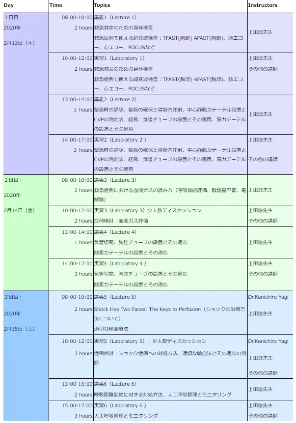

# 犬猫の緊急救命医療とは？

**
<2020年2月13日-15日開催>延期となりました。 開催期日が決まり次第お知らせいたします。
**

日 程 ：2020年2月13日（木）～15日（土） 3日間 
内 容 ： 「犬猫の緊急救命医療とは？」 

主催：Western Veterinary Conference (WVC) 

企画&運営：特定非営利活動法人　小動物疾患研究所 

後援：有限会社スピリッツ HJS事務局、日本獣医救急医療研究会、日本獣医クリティカルケア＆マネージメント研究会 

特別協賛：株式会社 V and P（VetzPetz ）、ペットコミュニケーションズ株式会社 

協賛：テルコム株式会社 

講師／WVCの規定に準じて講師は3名： 
・上田悠先生（カルフォルニア大学獣医学部、米国獣医救急医療専門医） 
・Kenichiro Yagi, RVT, VTS (ECC, SAIM), MS 
・中村篤史先生 
・川瀬広大先生

# 予定内容

#### 
コーディネーター　小宮山典寛

セミナーと実習（詳細は今後十分に検討して決定します、以下は参考程度です。ご希望のテーマをお知らせください）

講義：救急救命のための身体検査、緊急時の正しい取り扱い、ショックの定義、診断、治療、緊急時の輸液療法と電解質補正の方法、呼吸困難へのアプローチ、酸素吸入のテクニックとそのモニター法、適切な輸血法とその適応の判断、循環器系のアプローチ、急性腹症について等 
実習：救急救命のための身体検査、緊急時の静脈、動脈の確保と骨髄内注射、中心静脈圧の測定法、経鼻、食道、胃、空腸チューブの設置とその適用、超音波検査、TFAST(胸部) AFAST(胸部)、気管切開、胸腔チューブの設置等。

まだ内容は確定していませんので、ご希望のテーマがありましたら、お知らせください。

# プログラム

*犬猫の緊急救命医療とは？ *

1. オクエンドセンターにて毎回、軽い朝食が用意されます。
1. 初日に夕食会（懇親会）を予定しています。
1. 最終日には授与式と記念写真が行われます。

# 
講師紹介

・上田悠先生（カルフォルニア大学獣医学部、米国獣医救急医療専門医） 
・Kenichiro Yagi, RVT, VTS (ECC, SAIM), MS 
・中村篤史先生 
・川瀬広大先生